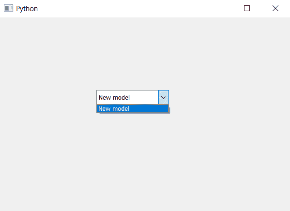

# PyQt5–如何将模型添加到组合框

> 原文:[https://www . geesforgeks . org/pyqt 5-如何将模型添加到组合框/](https://www.geeksforgeeks.org/pyqt5-how-to-add-model-to-combobox/)

在本文中，我们将看到如何为组合框设置模型。模型用于设置组合框的项目，为了设置模型我们将使用`setModel`方法。

**注意:**如果我们在插入项目之后添加模型，它将清除所有元素，因此模型应该在任何元素插入之前添加

> **语法:**组合框.集合模型(Model)
> 
> **参数:**它以 QStandardItemModel 对象为参数
> 
> **返回:**无

以下是实施–

```py
# importing libraries
from PyQt5.QtWidgets import * 
from PyQt5 import QtCore, QtGui
from PyQt5.QtGui import * 
from PyQt5.QtCore import * 
import sys

class Window(QMainWindow):

    def __init__(self):
        super().__init__()

        # setting title
        self.setWindowTitle("Python ")

        # setting geometry
        self.setGeometry(100, 100, 600, 400)

        # calling method
        self.UiComponents()

        # showing all the widgets
        self.show()

    # method for widgets
    def UiComponents(self):

        # creating a combo box widget
        self.combo_box = QComboBox(self)

        # setting geometry of combo box
        self.combo_box.setGeometry(200, 150, 150, 30)

        # geek list
        geek_list = ["Sayian", "Super Saiyan", "Super Sayian 2",
                                               "Super Sayian B"]

        # making it editable
        self.combo_box.setEditable(True)

        # adding list of items to combo box
        self.combo_box.addItems(geek_list)

        # creating a model
        model = QtGui.QStandardItemModel(0, 1)

        # creating a item
        item = QtGui.QStandardItem("New model")

        # adding item to the model
        model.appendRow(item)

        # setting model to the combo box
        self.combo_box.setModel(model)

# create pyqt5 app
App = QApplication(sys.argv)

# create the instance of our Window
window = Window()

# start the app
sys.exit(App.exec())
```

**输出:**
