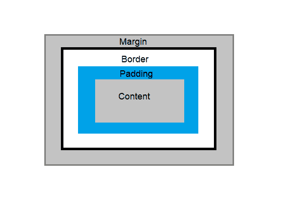
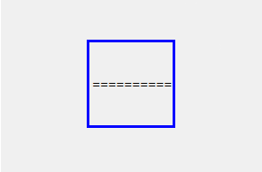
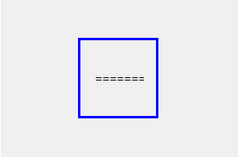
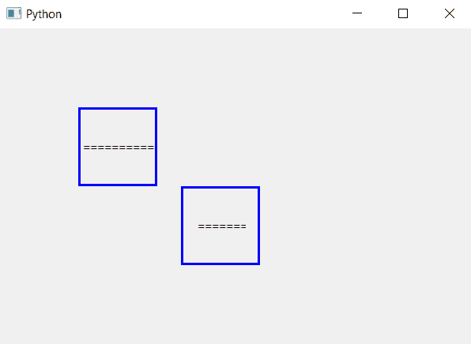

# pyqt 5–如何向标签添加填充？

> 原文:[https://www . geeksforgeeks . org/pyqt 5-如何将填充添加到标签/](https://www.geeksforgeeks.org/pyqt5-how-to-add-padding-to-a-label/)

在本文中，我们将看到如何向我们的标签添加填充。填充只是边框和内容之间的空间。下面是标签的图片，这将有助于更好地理解填充。



为了给我们的标签添加填充，我们将使用`setStyleSheet()`方法，下面是无填充标签与填充标签的外观。
 

> **语法:**label .set 样式表(“填充:15px”)
> 
> **自变量:**它以字符串为自变量。
> 
> **执行的操作:**向标签添加填充。

**代码:**

```py
# importing the required libraries

from PyQt5.QtCore import * 
from PyQt5.QtGui import * 
from PyQt5.QtWidgets import * 
import sys

class Window(QMainWindow):
    def __init__(self):
        super().__init__()

        # set the title
        self.setWindowTitle("Python")

        # setting  the geometry of window
        self.setGeometry(60, 60, 600, 400)

        # creating a label widget
        self.label_1 = QLabel("===============", self)

        # moving position
        self.label_1.move(100, 100)

        # setting up the border
        self.label_1.setStyleSheet("border :3px solid blue;")

        # resizing label
        self.label_1.resize(100, 100)
        # creating a label widget
        self.label_2 = QLabel("==================", self)

        # setting up the border and adding padding
        self.label_2.setStyleSheet("border :3px solid blue;padding :15px")

        # moving position
        self.label_2.move(230, 200)

        # resizing the label
        self.label_2.resize(100, 100)

        # show all the widgets
        self.show()

# create pyqt5 app
App = QApplication(sys.argv)

# create the instance of our Window
window = Window()
# start the app
sys.exit(App.exec())
```

**输出:**
