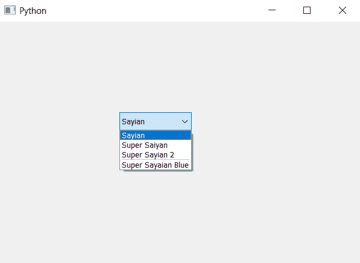

# PyQt5–如何在组合框

的项目之间添加分隔符

> 原文:[https://www . geesforgeks . org/pyqt 5-如何在组合框中添加项目分隔符/](https://www.geeksforgeeks.org/pyqt5-how-to-add-separator-in-between-the-item-of-combobox/)

在本文中，我们将看到如何在组合框中的所需索引处添加分隔符。默认情况下，没有分隔符。分隔符是两个项目之间的黑线，为了添加分隔符我们使用`insertSeparator`方法。下面是组合框项目的表示，分隔符看起来像–


> **语法:**组合框.插入分隔符(索引)
> 
> **自变量:**以整数为自变量，即索引
> 
> **执行的操作:**它将在给定的索引处添加分隔符

**注意:**如果索引等于或高于项目总数，则新项目会附加到现有项目列表中。如果索引为 0 或负，新项目将添加到现有项目列表的前面。

以下是实施–

```py
# importing libraries
from PyQt5.QtWidgets import * 
from PyQt5 import QtCore, QtGui
from PyQt5.QtGui import * 
from PyQt5.QtCore import * 
import sys

class Window(QMainWindow):

    def __init__(self):
        super().__init__()

        # setting title
        self.setWindowTitle("Python ")

        # setting geometry
        self.setGeometry(100, 100, 600, 400)

        # calling method
        self.UiComponents()

        # showing all the widgets
        self.show()

    # method for widgets
    def UiComponents(self):

        # creating a combo box widget
        self.combo_box = QComboBox(self)

        # setting geometry of combo box
        self.combo_box.setGeometry(200, 150, 120, 30)

        # geek list
        geek_list = ["Sayian", "Super Saiyan", "Super Sayian 2", "Super Sayaian Blue"]

        # adding list of items to combo box
        self.combo_box.addItems(geek_list)

        # index
        index = 3

        # adding separator at given index
        self.combo_box.insertSeparator(index)

# create pyqt5 app
App = QApplication(sys.argv)

# create the instance of our Window
window = Window()

# start the app
sys.exit(App.exec())
```

**输出:**
