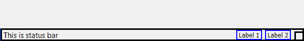
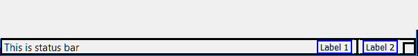
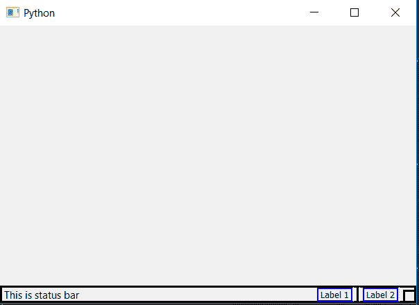

# PyQt5–如何在状态栏中添加分隔符？

> 原文:[https://www . geesforgeks . org/pyqt 5-如何在状态栏中添加分隔符/](https://www.geeksforgeeks.org/pyqt5-how-to-add-separator-in-status-bar/)

在本文中，我们将看到如何在状态栏中添加分隔符。**分隔符**基本上只是用来区分项目的竖线。

下面是带分隔符和不带分隔符的状态栏之间的区别。




主要概念是，我们将在两个标签之间添加一个小部件，它将是一条垂直线，充当分隔符。

**代码:**

```
from PyQt5.QtCore import * 
from PyQt5.QtGui import * 
from PyQt5.QtWidgets import * 
import sys

# creating VLine class
class VLine(QFrame):

    # a simple Vertical line
    def __init__(self):

        super(VLine, self).__init__()
        self.setFrameShape(self.VLine|self.Sunken)

class Window(QMainWindow):
    def __init__(self):
        super().__init__()

        # set the title
        self.setWindowTitle("Python")

        # setting  the geometry of window
        self.setGeometry(60, 60, 600, 400)

        # setting status bar message
        self.statusBar().showMessage("This is status bar")

        # setting  border and padding with different sizes
        self.statusBar().setStyleSheet("border :3px solid black;")

        # creating a label widget
        self.label_1 = QLabel("Label 1")

        # setting up the border
        self.label_1.setStyleSheet("border :2px solid blue;")

        # creating a label widget
        self.label_2 = QLabel("Label 2")

        # setting up the border
        self.label_2.setStyleSheet("border :2px solid blue;")

        # adding label to status bar
        self.statusBar().addPermanentWidget(self.label_1)

        # adding VLine object
        self.statusBar().addPermanentWidget(VLine())

        # adding label
        self.statusBar().addPermanentWidget(self.label_2)
        # show all the widgets
        self.show()

# create pyqt5 app
App = QApplication(sys.argv)

# create the instance of our Window
window = Window()

# start the app
sys.exit(App.exec())
```

**输出:**
