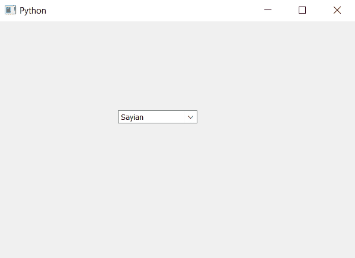

# PyQt5–如何根据项目大小

调整组合框的大小

> 原文:[https://www . geeksforgeeks . org/pyqt 5-如何根据项目大小调整组合框的大小/](https://www.geeksforgeeks.org/pyqt5-how-to-adjust-size-of-combobox-according-to-the-items-size/)

在本文中，我们将看到如何根据项目列表中最大的项目，根据项目的大小来调整组合框。默认情况下，我们使用`setGeometry`方法和`setSize`方法来调整大小，但它不会根据项目大小自动调整大小。

为了根据最大长度项目尺寸调整尺寸，我们使用`adjustSize`方法

> **语法:**组合框.调整大小()
> 
> **论证:**不需要论证
> 
> **返回:**无

以下是实施–

```
# importing libraries
from PyQt5.QtWidgets import * 
from PyQt5 import QtCore, QtGui
from PyQt5.QtGui import * 
from PyQt5.QtCore import * 
import sys

class Window(QMainWindow):

    def __init__(self):
        super().__init__()

        # setting title
        self.setWindowTitle("Python ")

        # setting geometry
        self.setGeometry(100, 100, 600, 400)

        # calling method
        self.UiComponents()

        # showing all the widgets
        self.show()

    # method for widgets
    def UiComponents(self):

        # creating a combo box widget
        self.combo_box = QComboBox(self)

        # setting geometry of combo box
        self.combo_box.setGeometry(200, 150, 200, 50)

        # geek list
        geek_list = ["Sayian", "Super Saiyan", "Super Sayian 2", "Super Sayian Blue"]

        # making it editable
        self.combo_box.setEditable(True)

        # adding list of items to combo box
        self.combo_box.addItems(geek_list)

        # adjusting the size according to the maximum sized element
        self.combo_box.adjustSize()

# create pyqt5 app
App = QApplication(sys.argv)

# create the instance of our Window
window = Window()

# start the app
sys.exit(App.exec())
```

**输出:**
