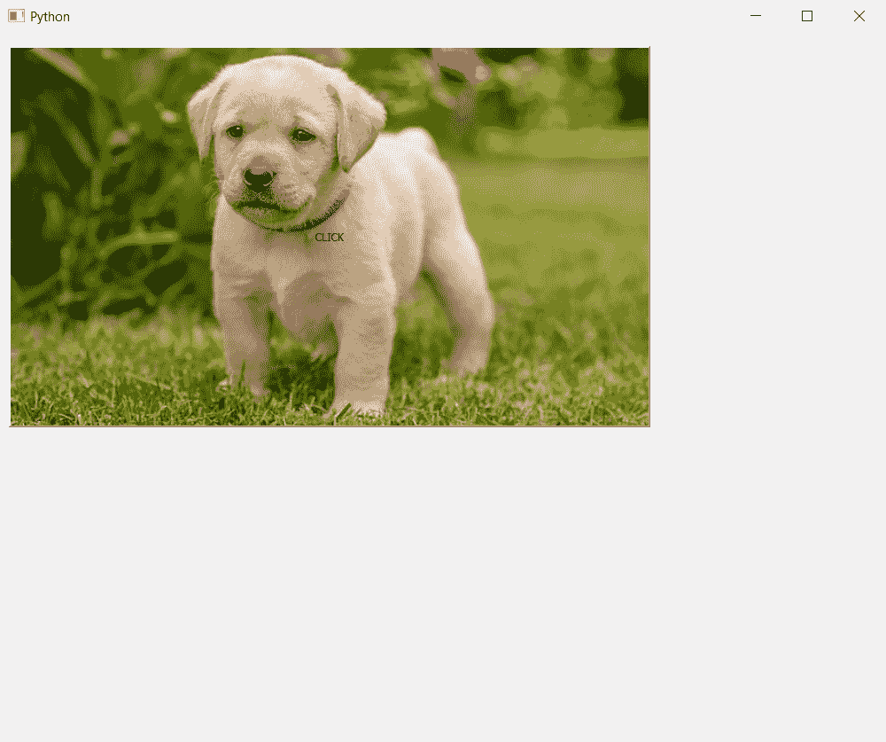
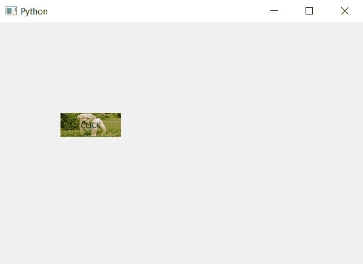

# PyQt5 |如何调整按钮内部的图像？

> 原文:[https://www . geesforgeks . org/pyqt 5-如何调整按钮内图像/](https://www.geeksforgeeks.org/pyqt5-how-to-adjust-the-image-inside-push-button/)

当我们将图像设置为按钮时，我们看到如果按钮尺寸小于图像，则图像将被裁剪。在本文中，我们将了解如何保留图像的实际大小。

> **有两种方法可以做到:**
> 
> **- >** 根据图像大小改变按钮大小。
> **- >** 代替使用背景图像使用图像作为皮肤。
> 
> **注意:**第一种方式，按钮大小可以改变，也可以不改变。这取决于图像大小，第二种方式是按钮大小不会发生变化。

**方法#1 :** 改变按钮大小。

**代码:**

```
# importing libraries
from PyQt5.QtWidgets import * 
from PyQt5.QtGui import * 
from PyQt5.QtCore import * 
import sys

class Window(QMainWindow):
    def __init__(self):
        super().__init__()

        # setting title
        self.setWindowTitle("Python ")

        # setting geometry
        self.setGeometry(100, 100, 1000, 800)

        # calling method
        self.UiComponents()

        # showing all the widgets
        self.show()

    # method for widgets
    def UiComponents(self):

        # creating a push button
        button = QPushButton("CLICK", self)

        # setting geometry of button
        button.setGeometry(10, 15, 100, 40)

        # adding action to a button
        button.clicked.connect(self.clickme)

        # setting background image
        button.setStyleSheet("background-image : url(image.png);")

        # resizing button according to size of image
        button.resize(724, 430)

    # action method
    def clickme(self):

        # printing pressed
        print("pressed")

# create pyqt5 app
App = QApplication(sys.argv)

# create the instance of our Window
window = Window()

# start the app
sys.exit(App.exec())
```

**输出:**

**注意:**如果图像尺寸过大，此方法不可取。

**方法#2 :** 将图像设置为皮肤。

**代码:**

```
# importing libraries
from PyQt5.QtWidgets import * 
from PyQt5.QtGui import * 
from PyQt5.QtCore import * 
import sys

class Window(QMainWindow):
    def __init__(self):
        super().__init__()

        # setting title
        self.setWindowTitle("Python ")

        # setting geometry
        self.setGeometry(100, 100, 600, 400)

        # calling method
        self.UiComponents()

        # showing all the widgets
        self.show()

    # method for widgets
    def UiComponents(self):

        # creating a push button
        button = QPushButton("CLICK", self)

        # setting geometry of button
        button.setGeometry(100, 150, 100, 40)

        # adding action to a button
        button.clicked.connect(self.clickme)

        # setting image as skin
        button.setStyleSheet("border-image : url(image.png);")

    # action method
    def clickme(self):

        # printing pressed
        print("pressed")

# create pyqt5 app
App = QApplication(sys.argv)

# create the instance of our Window
window = Window()

# start the app
sys.exit(App.exec())
```

**输出:**

**注意:**如果图像形状不是从按钮开始，则此方法不可取。