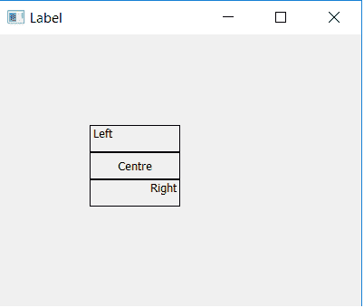

# pyqt 5–如何对齐标签文本

> 原文:[https://www . geesforgeks . org/pyqt 5-如何对齐标签文本/](https://www.geeksforgeeks.org/pyqt5-how-to-align-text-of-label/)

在本文中，我们将看到如何在 PyQt5 应用程序中对齐标签的文本，我们可以用三种不同的方式对齐文本，即左对齐、右对齐和居中对齐。

**语法:**

```
label.setAlignment(QtCore.Qt.AlignLeft)
label.setAlignment(QtCore.Qt.AlignCenter)
label.setAlignment(QtCore.Qt.AlignRight)

```

为了使用这个，我们必须从 PyQt5 导入`Qtcore`

```
from PyQt5 import QtCore
```

**下面是实现:**

```
# importing the required libraries

from PyQt5.QtWidgets import * 
from PyQt5 import QtCore
from PyQt5.QtGui import * 
import sys

class Window(QMainWindow):
    def __init__(self):
        super().__init__()

        # set the title
        self.setWindowTitle("Label")

        # setting  the geometry of window
        self.setGeometry(0, 0, 400, 300)

        # creating a label widget
        self.label_1 = QLabel('Left', self)

        # moving position
        self.label_1.move(100, 100)

        # setting up border
        self.label_1.setStyleSheet("border: 1px solid black;")

        # setting alignment to left
        self.label_1.setAlignment(QtCore.Qt.AlignLeft)

        # creating a label widget
        self.label_2 = QLabel('Centre', self)

        # moving position
        self.label_2.move(100, 130)

        # setting up border
        self.label_2.setStyleSheet("border: 1px solid black;")

        # setting alignment to centre
        self.label_2.setAlignment(QtCore.Qt.AlignCenter)

        # creating a label widget
        self.label_3 = QLabel('Right', self)

        # moving position
        self.label_3.move(100, 160)

        # setting up border
        self.label_3.setStyleSheet("border: 1px solid black;")

        # setting alignment to right
        self.label_3.setAlignment(QtCore.Qt.AlignRight)

        # show all the widgets
        self.show()

# create pyqt5 app
App = QApplication(sys.argv)

# create the instance of our Window
window = Window()

# start the app
sys.exit(App.exec())
```

**输出:**
