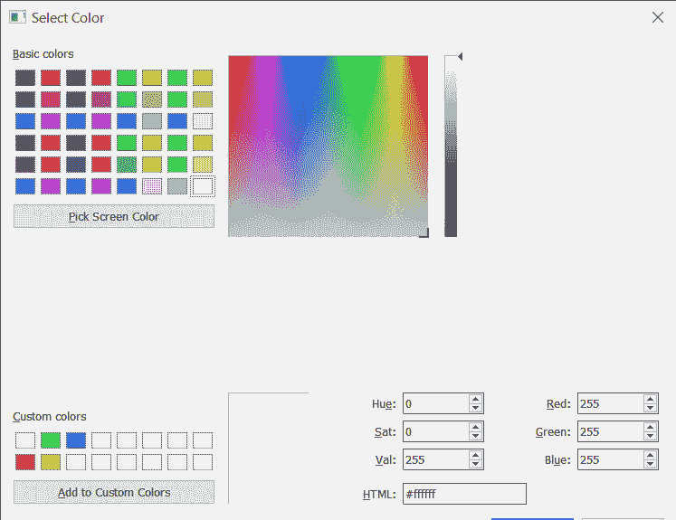

# PyQt5–如何允许 QColorDialog Widget 调整大小？

> 原文:[https://www . geeksforgeeks . org/pyqt 5-如何允许-qcolor dialog-widget-调整大小/](https://www.geeksforgeeks.org/pyqt5-how-to-allow-qcolordialog-widget-to-resize/)

在这篇文章中，我们将看到如何改变 QColorDialog 的大小。QColorDialog 有一个固定的大小，因为它包含几个定制的小部件，这些小部件不是设计成可调整大小的，尽管我们可以改变布局约束来允许它改变大小。

**注意:**布局很快变得混乱，甚至有一点点调整大小。此外，超过某个点，对话框将因浮点异常而崩溃，因此不建议调整对话框的大小。

为了做到这一点，我们对 QColorDialog 对象的布局对象使用`setSizeConstraint`方法

> **语法:** dialog.layout()。setSizeConstraint(QLayout。SetNoConstraint)
> 
> **自变量:**以布局尺寸约束对象为自变量
> 
> **返回:**返回无

下面是实现

```
# importing libraries
from PyQt5.QtWidgets import * 
from PyQt5 import QtCore, QtGui
from PyQt5.QtGui import * 
from PyQt5.QtCore import * 
import sys

class Window(QMainWindow):

    def __init__(self):
        super().__init__()

        # setting title
        self.setWindowTitle("Python ")

        # setting geometry
        self.setGeometry(100, 100, 500, 400)

        # calling method
        self.UiComponents()

        # showing all the widgets
        self.show()

    # method for components
    def UiComponents(self):

        # creating a QColorDialog object
        dialog = QColorDialog(self)

        # making size grip property enabled
        dialog.setSizeGripEnabled(True)

        # allowing dialog to get resized
        dialog.layout().setSizeConstraint(QLayout.SetNoConstraint)

        # setting custom colors
        dialog.setCustomColor(1, Qt.red)
        dialog.setCustomColor(2, Qt.green)
        dialog.setCustomColor(3, Qt.yellow)
        dialog.setCustomColor(4, Qt.blue)

        # executing the dialog
        dialog.exec_()

        # creating label
        label = QLabel("GeeksforGeeks", self)

        # setting geometry to the label
        label.setGeometry(10, 10, 400, 280)

        # making label multi line
        label.setWordWrap(True)

        # setting stylesheet of the label
        label.setStyleSheet("QLabel"
                            "{"
                            "border : 5px solid black;"
                            "}")

        # getting the custom color
        color = dialog.customColor(4)

        # setting graphic effect to the label
        graphic = QGraphicsColorizeEffect(self)

        # setting color to the graphic
        graphic.setColor(color)

        # setting graphic to the label
        label.setGraphicsEffect(graphic)

        self.deleteLater()

# create pyqt5 app
App = QApplication(sys.argv)

# create the instance of our Window
window = Window()

# start the app
sys.exit(App.exec())
```

**输出:**


