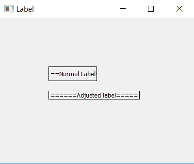

# PyQt5–如何自动调整标签尺寸|调整标签尺寸

> 原文:[https://www . geesforgeks . org/pyqt 5-如何自动调整大小-标签-调整大小-qlabel/](https://www.geeksforgeeks.org/pyqt5-how-to-auto-resize-label-adjustsize-qlabel/)

在 GUI(图形用户界面)应用程序的设计过程中，需要显示纯文本作为使用标签的信息，但有时信息文本可能很大或很小，很难使用`resize()`方法，因此必须根据文本自动调整标签的大小，为此可以使用`adjustSize()`方法。

`adjustSize()`方法会根据文本的长度改变标签的大小，如果长度少了会减少小部件的长度和高度，反之亦然。

> **语法:**label . adjustize()
> 
> **论证:**不需要论证。

**代码:**

```py
# importing the required libraries

from PyQt5.QtWidgets import * 
from PyQt5 import QtCore
from PyQt5.QtGui import * 
import sys

class Window(QMainWindow):
    def __init__(self):
        super().__init__()

        # set the title
        self.setWindowTitle("Label")

        # setting  the geometry of window
        self.setGeometry(0, 0, 400, 300)

        # creating a label widget
        self.label_1 = QLabel("== Normal Label ====", self)

        # moving position
        self.label_1.move(100, 100)

        # setting up border
        self.label_1.setStyleSheet("border: 1px solid black;")

        # creating a label widget
        self.label_2 = QLabel("====== Adjusted label =====", self)

        # moving position
        self.label_2.move(100, 150)

        # setting up border
        self.label_2.setStyleSheet("border: 1px solid black;")

        # adjusting the size of label
        self.label_2.adjustSize()

        # show all the widgets
        self.show()

# create pyqt5 app
App = QApplication(sys.argv)

# create the instance of our Window
window = Window()

# start the app
sys.exit(App.exec())
```

**输出:**
