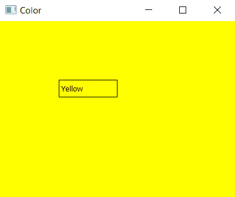
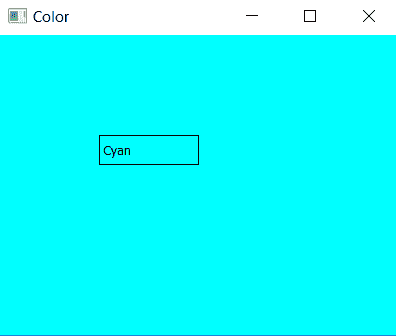

# pyqt 5–如何更改主窗口的背景颜色？

> 原文:[https://www . geesforgeks . org/pyqt 5-如何更改主窗口背景颜色/](https://www.geeksforgeeks.org/pyqt5-how-to-change-background-color-of-main-window/)

用 PyQt 创建桌面应用程序的第一步是让一个窗口显示在你的桌面上，在本文中，我们将看到如何改变这个窗口的颜色。为了改变主窗口的颜色，我们使用`setStylesheet()`方法。

> **语法:**设置样式表(“背景色:灰色；”)
> 
> **自变量:**它以字符串作为自变量。

**示例#1:**

```
# importing the required libraries

from PyQt5.QtWidgets import * 
from PyQt5 import QtCore
from PyQt5.QtGui import * 
import sys

class Window(QMainWindow):
    def __init__(self):
        super().__init__()

        # changing the background color to yellow
        self.setStyleSheet("background-color: yellow;")

        # set the title
        self.setWindowTitle("Color")

        # setting  the geometry of window
        self.setGeometry(0, 0, 400, 300)

        # creating a label widget
        self.label = QLabel("Yellow", self)

        # moving position
        self.label.move(100, 100)

        # setting up border
        self.label.setStyleSheet("border: 1px solid black;")

        # show all the widgets
        self.show()

# create pyqt5 app
App = QApplication(sys.argv)

# create the instance of our Window
window = Window()

# start the app
sys.exit(App.exec())
```

**输出:**


**例 2:**

```
# importing the required libraries

from PyQt5.QtWidgets import * 
from PyQt5 import QtCore
from PyQt5.QtGui import * 
import sys

class Window(QMainWindow):
    def __init__(self):
        super().__init__()

        # changing the background color to cyan
        self.setStyleSheet("background-color: cyan;")

        # set the title
        self.setWindowTitle("Color")

        # setting  the geometry of window
        self.setGeometry(0, 0, 400, 300)

        # creating a label widget
        self.label = QLabel("Cyan", self)

        # moving position
        self.label.move(100, 100)

        # setting up border
        self.label.setStyleSheet("border: 1px solid black;")

        # show all the widgets
        self.show()

# create pyqt5 app
App = QApplication(sys.argv)

# create the instance of our Window
window = Window()

# start the app
sys.exit(App.exec())
```

**输出:**
