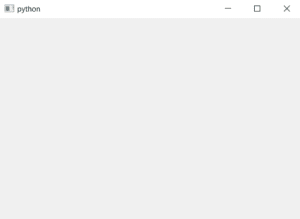
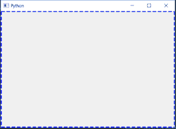
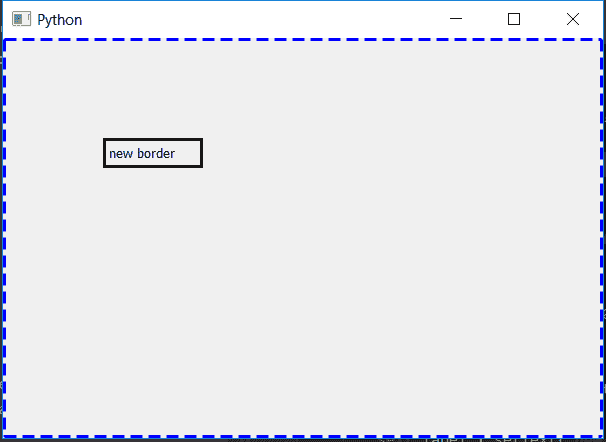

# PyQt5–如何更改主窗口的边框样式？

> 原文:[https://www . geeksforgeeks . org/pyqt 5-如何更改主窗口的边框样式/](https://www.geeksforgeeks.org/pyqt5-how-to-change-border-style-of-mainwindow/)

当我们在 PyQt5 中创建一个窗口时，默认情况下，它没有特殊类型的边框。但是我们使用`setStyleSheet()`方法改变主窗口的样式、厚度以及颜色。

下图是普通边框与样式化边框的外观
 

> **语法:**self .set 样式表(“边框:3px 蓝色虚线；”)
> 
> **自变量:**以字符串为自变量。
> `"border : size_of_border type_of_border color_of_border;"`
> 
> **执行的动作:**设置边框样式。

**代码:**

```py
# importing the required libraries

from PyQt5.QtCore import * 
from PyQt5.QtGui import * 
from PyQt5.QtWidgets import * 
import sys

class Window(QMainWindow):
    def __init__(self):
        super().__init__()

        # set the title
        self.setWindowTitle("Python")

        # setting geometry
        self.setGeometry(100, 100, 600, 400)

        # setting up the style of border
        self.setStyleSheet("border : 3px dashed blue;")

        # creating a label widget
        self.label_1 = QLabel("new border ", self)

        # moving position
        self.label_1.move(100, 100)

        # setting up the border
        self.label_1.setStyleSheet("border :3px solid black;")

        # show all the widgets
        self.show()

# create pyqt5 app
App = QApplication(sys.argv)

# create the instance of our Window
window = Window()

# start the app
sys.exit(App.exec())
```

**输出:**
