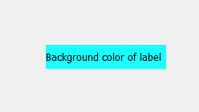
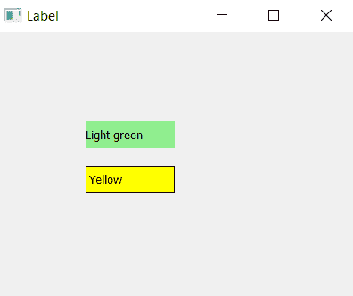

# pyqt 5–如何改变标签的颜色？

> 原文:[https://www . geesforgeks . org/pyqt 5-如何更改标签颜色/](https://www.geeksforgeeks.org/pyqt5-how-to-change-color-of-the-label/)

在 PyQt5 中创建标签时，我们可以看到没有背景颜色。在本文中，我们将看到如何为标签添加背景色。


为了给标签添加边框，我们将使用`label.setStyleSheet()`方法，这将为标签添加背景颜色，就像设计 CSS 样式表一样。

> **语法:**label .set 样式表(“背景色:青色”)
> 
> **自变量:**它以字符串为自变量。
> 
> **执行的动作:**改变标签的背景颜色。

**代码:**

```py
# importing the required libraries

from PyQt5.QtWidgets import * 
from PyQt5.QtGui import * 
import sys

class Window(QMainWindow):
    def __init__(self):
        super().__init__()

        # set the title
        self.setWindowTitle("Label")

        # setting  the geometry of window
        self.setGeometry(0, 0, 400, 300)

        # creating a label widget
        # by default label will display at top left corner
        self.label_1 = QLabel('Light green', self)

        # moving position
        self.label_1.move(100, 100)

        # setting up background color
        self.label_1.setStyleSheet("background-color: lightgreen")

        # creating a label widget
        # by default label will display at top left corner
        self.label_2 = QLabel('Yellow', self)

        # moving position
        self.label_2.move(100, 150)

        # setting up background color and border
        self.label_2.setStyleSheet("background-color: yellow; 
                                    border: 1px solid black;")

        # show all the widgets
        self.show()

# create pyqt5 app
App = QApplication(sys.argv)

# create the instance of our Window
window = Window()
# start the app
sys.exit(App.exec())
```

**输出:**
