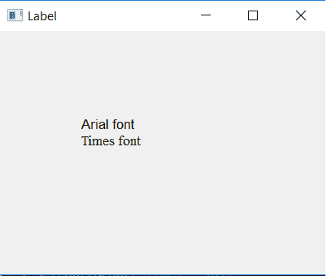

# pyqt 5–如何更改标签文本的字体和大小？

> 原文:[https://www . geesforgeks . org/pyqt 5-如何更改标签文本的字体和大小/](https://www.geeksforgeeks.org/pyqt5-how-to-change-font-and-size-of-label-text/)

一个**标签**是一个在表单上显示文本的图形控制元素。标签通常用于标识附近的文本框或其他小部件。有些标签可以响应鼠标点击等事件，允许复制标签的文本，但这不是标准的用户界面实践。

在本文中，我们将看到如何在 Label 中更改文本的字体和大小，我们可以通过使用`setFont()`方法来实现。

> **语法:**label . set font(qfont(font _ name，size))
> 
> **论证:**需要两个论证:
> 1。字体名称可以是' Arial '，' Times '等。
> 2。要设置为整数的大小。

下面是 Python 实现–

```
# importing the required libraries

from PyQt5.QtWidgets import * 
from PyQt5.QtGui import * 
import sys

class Window(QMainWindow):
    def __init__(self):
        super().__init__()

        # set the title
        self.setWindowTitle("Label")

        # setting  the geometry of window
        self.setGeometry(0, 0, 400, 300)

        # creating a label widget
        # by default label will display at top left corner
        self.label_1 = QLabel('Arial font', self)

        # moving position
        self.label_1.move(100, 100)

        # setting font and size
        self.label_1.setFont(QFont('Arial', 10))

        # creating a label widget
        # by default label will display at top left corner
        self.label_2 = QLabel('Times font', self)

        # moving position
        self.label_2.move(100, 120)

        # setting font and size
        self.label_2.setFont(QFont('Times', 10))

        # show all the widgets
        self.show()

# create pyqt5 app
App = QApplication(sys.argv)

# create the instance of our Window
window = Window()

# start the app
sys.exit(App.exec())
```

**输出:**
