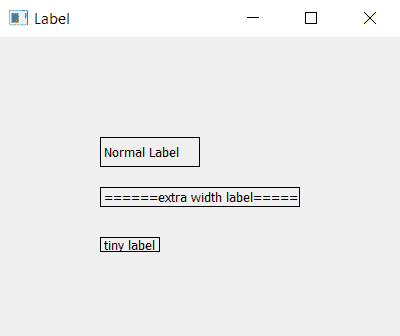

# PyQt5–如何更改标签| label.resize 方法

> 原文:[https://www . geesforgeks . org/pyqt 5-如何更改标签大小-标签-调整大小-方法/](https://www.geeksforgeeks.org/pyqt5-how-to-change-size-of-the-label-label-resize-method/)

在设计任何图形用户界面(GUI)应用程序时，我们都会创建提供信息的标签，但有时可能会出现标签大小不适合内容的情况，这时就需要调整标签的大小。

在本教程中，我们将看到如何在 PyQt5 中更改标签的大小。为此我们将使用`resize()`方法。

> **语法:**标签.调整大小(宽度，高度)
> 
> **自变量:**取两个整数作为自变量，它们是:
> 1。要设置的宽度。
> 2。高度待定。

**代码:**

```py
# importing the required libraries

from PyQt5.QtWidgets import * 
from PyQt5 import QtCore
from PyQt5.QtGui import * 
import sys

class Window(QMainWindow):
    def __init__(self):
        super().__init__()

        # set the title
        self.setWindowTitle("Label")

        # setting  the geometry of window
        self.setGeometry(0, 0, 400, 300)

        # creating a label widget
        self.label_1 = QLabel('Normal Label', self)

        # moving position
        self.label_1.move(100, 100)

        # setting up border
        self.label_1.setStyleSheet("border: 1px solid black;")

        # creating a label widget
        self.label_2 = QLabel('====== extra width label =====', self)

        # moving position
        self.label_2.move(100, 150)

        # setting up border
        self.label_2.setStyleSheet("border: 1px solid black;")

        # resizing the widget
        self.label_2.resize(200, 20)

        # creating a label widget
        self.label_3 = QLabel('tiny label', self)

        # moving position
        self.label_3.move(100, 200)

        # setting up border
        self.label_3.setStyleSheet("border: 1px solid black;")

        # resizing the widget
        self.label_3.resize(60, 15)

        # show all the widgets
        self.show()

# create pyqt5 app
App = QApplication(sys.argv)

# create the instance of our Window
window = Window()

# start the app
sys.exit(App.exec())
```

**输出:**
