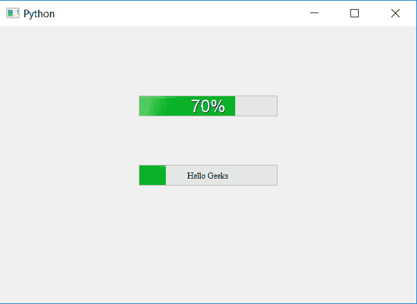

# PyQt5–如何更改文本进度条的样式和大小？

> 原文:[https://www . geesforgeks . org/pyqt 5-如何更改文本样式和大小进度条/](https://www.geeksforgeeks.org/pyqt5-how-to-change-style-and-size-of-text-progress-bar/)

在本文中，我们将看到如何改变进度条内的字体样式和数据大小。我们可以使用`setFormat`方法在进度条中设置文本。为了改变字体和大小，我们将使用`setFont`方法，该方法以 QFont 对象为参数，字体和大小将被改变。

> **语法:** bar.setFont(QFont(font_name，size))
> 
> **自变量:**它以 QFont 对象为自变量。
> 
> **执行的操作:**这将改变文本的字体和大小。

下面是实现。

```py
# importing libraries
from PyQt5.QtWidgets import * 
from PyQt5 import QtCore, QtGui
from PyQt5.QtGui import * 
from PyQt5.QtCore import * 
import sys

class Window(QMainWindow):

    def __init__(self):
        super().__init__()

        # setting title
        self.setWindowTitle("Python ")

        # setting geometry
        self.setGeometry(100, 100, 600, 400)

        # calling method
        self.UiComponents()

        # showing all the widgets
        self.show()

    # method for widgets
    def UiComponents(self):
        # creating progress bar
        bar1 = QProgressBar(self)

        # setting geometry to progress bar
        bar1.setGeometry(200, 100, 200, 30)

        # setting the value
        bar1.setValue(70)

        # setting alignment to center
        bar1.setAlignment(Qt.AlignCenter)

        # setting font and the size
        bar1.setFont(QFont('Arial', 15))

        # creating progress bar
        bar2 = QProgressBar(self)

        # setting geometry to progress bar
        bar2.setGeometry(200, 200, 200, 30)

        # setting the value
        bar2.setValue(20)

        # adding text using setFormat
        bar2.setFormat("Hello Geeks")

        # setting alignment to center
        bar2.setAlignment(Qt.AlignCenter)

        # setting font and the size
        bar2.setFont(QFont('Times', 7))

App = QApplication(sys.argv)

# create the instance of our Window
window = Window()

# start the app
sys.exit(App.exec())
```

**输出:**
