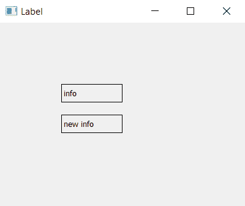

# PyQt5–如何更改预先存在的标签的文本|设置文本方法

> 原文:[https://www . geesforgeks . org/pyqt 5-如何更改预先存在的文本-标签-设置文本-方法/](https://www.geeksforgeeks.org/pyqt5-how-to-change-text-of-pre-existing-label-settext-method/)

在图形用户界面应用程序中，需要使用 PyQt5 中的标签来显示信息，但有时也需要更改标签的文本，在本教程中，我们将了解如何做到这一点。

`setText()`方法用于改变标签的内容。

> **语法:** label.setText(Info)
> 
> **自变量:**它以字符串作为自变量。

**代码:**

```
# importing the required libraries

from PyQt5.QtWidgets import * 
from PyQt5 import QtCore
from PyQt5.QtGui import * 
import sys

class Window(QMainWindow):
    def __init__(self):
        super().__init__()

        # informations
        info = "info"
        new_info = "new info "

        # set the title
        self.setWindowTitle("Label")

        # setting  the geometry of window
        self.setGeometry(0, 0, 400, 300)

        # creating a label widget
        self.label_1 = QLabel(info, self)

        # moving position
        self.label_1.move(100, 100)

        # setting up border
        self.label_1.setStyleSheet("border: 1px solid black;")

        # creating a label widget
        self.label_2 = QLabel(info, self)

        # moving position
        self.label_2.move(100, 150)

        # setting up border
        self.label_2.setStyleSheet("border: 1px solid black;")

        # changing the text of label
        self.label_2.setText(new_info)

        # show all the widgets
        self.show()

# create pyqt5 app
App = QApplication(sys.argv)

# create the instance of our Window
window = Window()

# start the app
sys.exit(App.exec())
```

**输出:**
