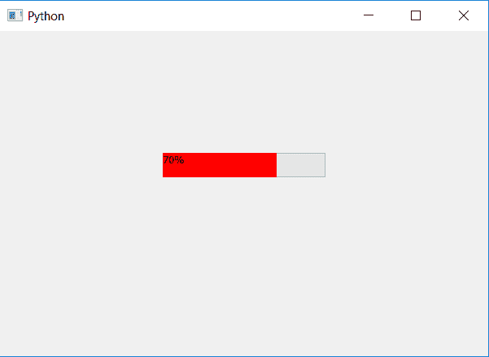

# PyQt5 |如何更改工艺条颜色？

> 原文:[https://www . geeksforgeeks . org/pyqt 5-如何更改进程条颜色/](https://www.geeksforgeeks.org/pyqt5-how-to-change-the-process-bar-color/)

在本文中，我们将看到如何改变进度条的颜色。默认情况下，进程栏的颜色是绿色，尽管 PyQt5 允许我们使用样式表更改颜色。

为了做到这一点，我们将使用`setStyleSheet`方法，并将编辑进程栏的 CSS 块文件。

> **语法:**
> 
> ```py
> bar.setStyleSheet("QProgressBar::chunk "
>                   "{"
>                     "background-color: red;"
>                   "}")
> 
> ```
> 
> **执行的动作:**会改变进程条的颜色。

```py
# importing libraries
from PyQt5.QtWidgets import * 
from PyQt5 import QtCore, QtGui
from PyQt5.QtGui import * 
from PyQt5.QtCore import * 
import sys

class Window(QMainWindow):

    def __init__(self):
        super().__init__()

        # setting title
        self.setWindowTitle("Python ")

        # setting geometry
        self.setGeometry(100, 100, 600, 400)

        # calling method
        self.UiComponents()

        # showing all the widgets
        self.show()

    # method for widgets
    def UiComponents(self):

        # creating progress bar
        bar = QProgressBar(self)

        # setting geometry to progress bar
        bar.setGeometry(200, 150, 200, 30)

        # set value to progress bar
        bar.setValue(70)

        # changing the color of process bar
        bar.setStyleSheet("QProgressBar::chunk "
                          "{"
                          "background-color: red;"
                          "}")

# create pyqt5 app
App = QApplication(sys.argv)

# create the instance of our Window
window = Window()

# start the app
sys.exit(App.exec())
```

**输出:**
