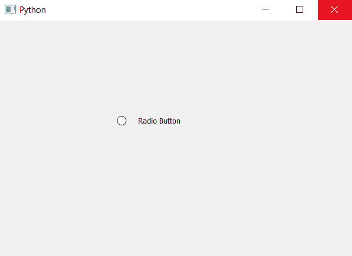

# pyqt 5–如何更改单选按钮的指示器和文本部分之间的间距？

> 原文:[https://www . geesforgeks . org/pyqt 5-如何更改单选按钮的指示器和文本部分之间的间距/](https://www.geeksforgeeks.org/pyqt5-how-to-change-the-spacing-between-indicator-and-text-part-of-radio-button/)

在本文中，我们将看到如何更改指示器和单选按钮文本部分之间的间距。间距基本上是指示器和文本部分之间的距离。

我们可以借助`setStyleSheet`方法改变它们之间的距离，这个方法帮助我们为单选按钮设置样式表。下面是样式表代码。

```py
QRadioButton
{
spacing : 20px;
}

```

下面是实现。

```py
# importing libraries
from PyQt5.QtWidgets import * 
from PyQt5 import QtCore, QtGui
from PyQt5.QtGui import * 
from PyQt5.QtCore import * 
import sys

class Window(QMainWindow):

    def __init__(self):
        super().__init__()

        # setting title
        self.setWindowTitle("Python ")

        # setting geometry
        self.setGeometry(100, 100, 600, 400)

        # calling method
        self.UiComponents()

        # showing all the widgets
        self.show()

    # method for widgets
    def UiComponents(self):

        # creating a radio button
        radio_button = QRadioButton(self)

        # setting geometry of radio button
        radio_button.setGeometry(200, 150, 120, 40)

        # setting text to radio button
        radio_button.setText("Radio Button")

        # adding spacing between text part and indicator part
        radio_button.setStyleSheet("QRadioButton"
                                   "{"
                                   "spacing : 20px;"
                                   "}")

# create pyqt5 app
App = QApplication(sys.argv)

# create the instance of our Window
window = Window()

# start the app
sys.exit(App.exec())
```

**输出:**
