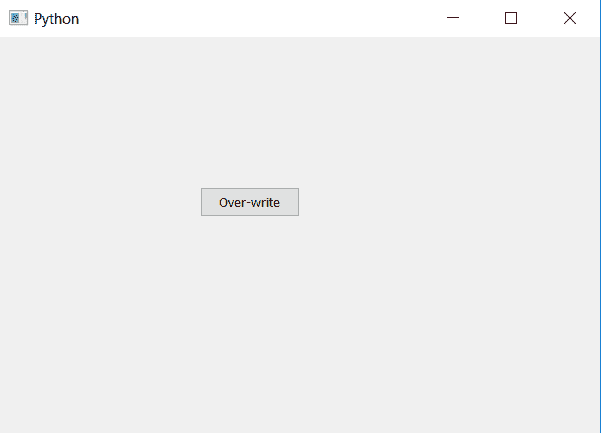

# pyqt 5–如何更改现有按钮的文本？

> 原文:[https://www . geesforgeks . org/pyqt 5-如何更改现有按钮的文本/](https://www.geeksforgeeks.org/pyqt5-how-to-change-the-text-of-existing-push-button/)

在本文中，我们将看到如何改变现有按钮的文本。我们知道，当我们创建一个按钮时，我们为它设置了文本，但有时，会出现按钮重复使用的情况，即按钮应该正常运行，只是改变它的文本，所以它看起来不同。

为了做到这一点，我们使用`setText`方法。这个方法将改写按钮的现有文本。

> **语法:**按钮.设置文本(new_text)
> 
> **自变量:**它以字符串为自变量。
> 
> **执行的动作:**重写按钮的文本。

**代码:**

```py
# importing libraries
from PyQt5.QtWidgets import * 
from PyQt5.QtGui import * 
from PyQt5.QtCore import * 
import sys

class Window(QMainWindow):
    def __init__(self):
        super().__init__()

        # setting title
        self.setWindowTitle("Python ")

        # setting geometry
        self.setGeometry(100, 100, 600, 400)

        # calling method
        self.UiComponents()

        # showing all the widgets
        self.show()

    # method for widgets
    def UiComponents(self):

        # creating a push button
        button = QPushButton("CLICK", self)

        # setting geometry of button
        button.setGeometry(200, 150, 100, 30)

        # adding action to a button
        button.clicked.connect(self.clickme)

        # changing the text of button
        button.setText("Over-write")

    # action method
    def clickme(self):

        # printing pressed
        print("pressed")

# create pyqt5 app
App = QApplication(sys.argv)

# create the instance of our Window
window = Window()

# start the app
sys.exit(App.exec())
```

**输出:**
