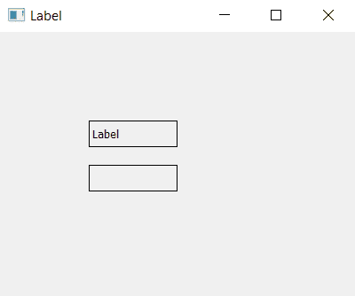

# PyQt5–如何清除标签内容|清除并设置文本方法

> 原文:[https://www . geesforgeks . org/pyqt 5-如何清除标签内容-清除和设置文本方法/](https://www.geeksforgeeks.org/pyqt5-how-to-clear-the-content-of-label-clear-and-settext-method/)

在本文中，我们将看到如何轻松清除/擦除 PyQt5 应用程序的标签内容。这可以通过两种方式实现–

1.  使用`clear()`方法，这将清除标签的内容。
2.  使用`setText()`方法传递一个空字符串，这会用空字符串更新内容。

## 使用`clear()`方法–

> **语法:** label.clear()
> 
> **论证:**不需要论证。

**代码:**

```py
# importing the required libraries

from PyQt5.QtWidgets import * 
from PyQt5 import QtCore
from PyQt5.QtGui import * 
import sys

class Window(QMainWindow):
    def __init__(self):
        super().__init__()

        # set the title
        self.setWindowTitle("Label")

        # setting  the geometry of window
        self.setGeometry(0, 0, 400, 300)

        # creating a label widget
        self.label_1 = QLabel("Label", self)

        # moving position
        self.label_1.move(100, 100)

        # setting up border
        self.label_1.setStyleSheet("border: 1px solid black;")

        # creating a label widget
        self.label_2 = QLabel("Hidden Label", self)

        # moving position
        self.label_2.move(100, 150)

        # setting up border
        self.label_2.setStyleSheet("border: 1px solid black;")

        # clearing the data
        self.label_2.clear()

        # show all the widgets
        self.show()

# create pyqt5 app
App = QApplication(sys.argv)

# create the instance of our Window
window = Window()

# start the app
sys.exit(App.exec())
```

**输出:**


## 使用`setText()`方法–

> **语法:** label.setText(")
> 
> **自变量:**它以字符串为自变量，这里字符串将为空。

**代码:**

```py
# importing the required libraries

from PyQt5.QtWidgets import * 
from PyQt5 import QtCore
from PyQt5.QtGui import * 
import sys

class Window(QMainWindow):
    def __init__(self):
        super().__init__()

        # set the title
        self.setWindowTitle("Label")

        # setting  the geometry of window
        self.setGeometry(0, 0, 400, 300)

        # creating a label widget
        self.label_1 = QLabel("Label", self)

        # moving position
        self.label_1.move(100, 100)

        # setting up border
        self.label_1.setStyleSheet("border: 1px solid black;")

        # creating a label widget
        self.label_2 = QLabel("Hidden Label", self)

        # moving position
        self.label_2.move(100, 150)

        # setting up border
        self.label_2.setStyleSheet("border: 1px solid black;")

        # replacing content with blank
        self.label_2.setText("")

        # show all the widgets
        self.show()

# create pyqt5 app
App = QApplication(sys.argv)

# create the instance of our Window
window = Window()

# start the app
sys.exit(App.exec())
```

**输出:**
