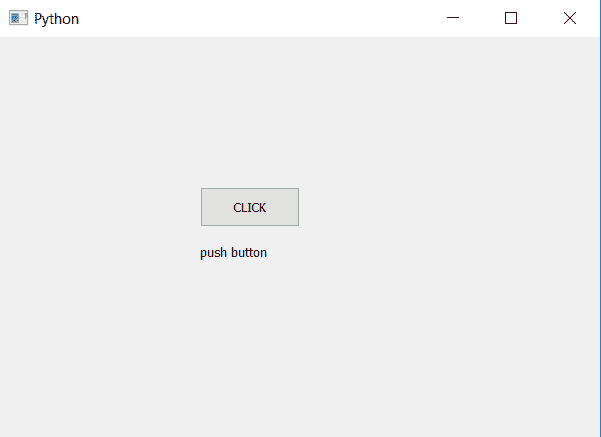

# PyQt5–如何创建和获取按钮的名称？

> 原文:[https://www . geesforgeks . org/pyqt 5-如何创建和获取按钮名称/](https://www.geeksforgeeks.org/pyqt5-how-to-create-and-get-the-name-of-push-button/)

在本文中，我们将看到如何创建和获取按钮的名称。当我们设计一个图形用户界面应用程序时，我们会创建许多按钮。为了对它们进行分类，我们为它们命名，例如“设置按钮”、“显示按钮”等。
为了创建名称，我们使用了 setAccessibleName 方法，为了获得名称，我们起诉了 AccessibleName。
**注意:**如果没有创建名称，我们试图获取名称，它将返回空字符串。

> **语法:**
> 
> ```
> button.setAccessibleName(name)
> button.accessibleName()
> ```
> 
> **参数:**
> setAccessibleName 以字符串为参数。
> accessibleName 不接受参数。
> **返回:**
> setAccessibleName 返回 None。
> accessibleName 返回字符串。

**代码:**

## 蟒蛇 3

```
# importing libraries
from PyQt5.QtWidgets import *
from PyQt5.QtGui import *
from PyQt5.QtCore import *
import sys

class Window(QMainWindow):
    def __init__(self):
        super().__init__()

        # setting title
        self.setWindowTitle("Python ")

        # setting geometry
        self.setGeometry(100, 100, 600, 400)

        # calling method
        self.UiComponents()

        # showing all the widgets
        self.show()

    # method for widgets
    def UiComponents(self):

        # creating a push button
        button = QPushButton("CLICK", self)

        # setting geometry of button
        button.setGeometry(200, 150, 100, 40)

        # setting name
        button.setAccessibleName("push button")

        # adding action to a button
        button.clicked.connect(self.clickme)

        # accessing the name of button
        name = button.accessibleName()

        # creating a label to display a name
        label = QLabel(self)
        label.setText(name)
        label.move(200, 200)

    # action method
    def clickme(self):

        # printing pressed
        print("pressed")

# create pyqt5 app
App = QApplication(sys.argv)

# create the instance of our Window
window = Window()

# start the app
sys.exit(App.exec())
```

**输出:**

