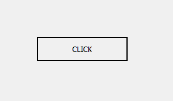
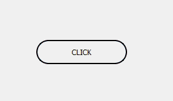
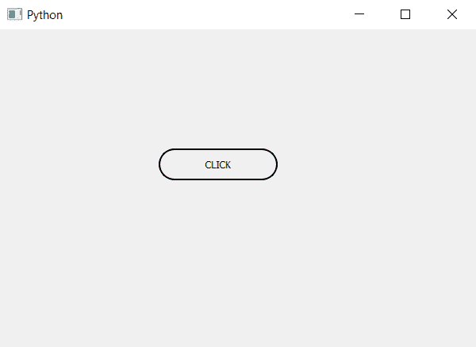

# PyQt5 |如何创建胶囊形状的按钮？

> 原文:[https://www . geesforgeks . org/pyqt 5-如何创建胶囊形按钮/](https://www.geeksforgeeks.org/pyqt5-how-to-create-capsule-shaped-push-button/)

胶囊的形状基本上是由一个矩形和两个半圆连接而成的，在本教程中我们将看到如何创建这些形状的按钮。

下图是普通按钮和胶囊形按钮。
 

> **为了创建胶囊形状按钮，我们必须执行以下步骤:**
> 
> 1.创建一个按钮。
> 2。调整按钮的大小，使其成为矩形。
> 3。使用样式表将按钮的半径设置为高度的一半。

**注意:**如果按钮不是矩形，它将变成圆形。

**代码:**

```py
# importing libraries
from PyQt5.QtWidgets import * 
from PyQt5.QtGui import * 
from PyQt5.QtCore import * 
import sys

class Window(QMainWindow):
    def __init__(self):
        super().__init__()

        # setting title
        self.setWindowTitle("Python ")

        # setting geometry
        self.setGeometry(100, 100, 600, 400)

        # calling method
        self.UiComponents()

        # showing all the widgets
        self.show()

    # method for widgets
    def UiComponents(self):

        # creating a push button
        button = QPushButton("CLICK", self)

        # setting geometry of button
        # rectangular shape i.e width > height
        button.setGeometry(200, 150, 150, 40)

        # adding action to a button
        button.clicked.connect(self.clickme)

        # setting border and radius
        # radius = half of height
        button.setStyleSheet("border : 2px solid black; 
                              border-radius : 20px;")

    # action method
    def clickme(self):

        # printing pressed
        print("pressed")

# create pyqt5 app
App = QApplication(sys.argv)

# create the instance of our Window
window = Window()

# start the app
sys.exit(App.exec())
```

**输出:**
