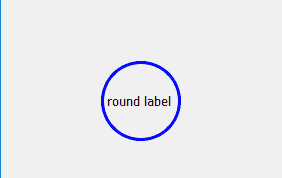
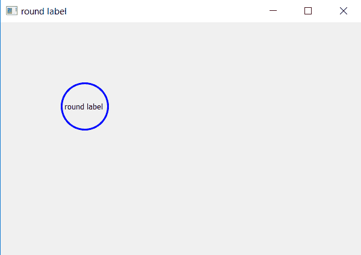

# PyQt5–如何创建圆标签？

> 原文:[https://www . geesforgeks . org/pyqt 5-如何创建圈-标签/](https://www.geeksforgeeks.org/pyqt5-how-to-create-circle-label/)

当我们创建标签时，默认情况下，它们的形状是矩形，我们可以使用`resize()`方法来更改其宽度和高度，但仍然是四边形。

在本文中，我们将看到如何创建圆形，即圆形标签。为了做到这一点，我们将首先创建一个正方形标签，然后借助`setStyleSheet()`方法将其边框半径更改为标签长度的一半，如下所示。



> **语法:**label .set 样式表(边框半径:40px")
> 
> **自变量:**它以字符串为自变量。
> 
> **执行的操作:**更改标签的边框半径。

**代码:**

```py
# importing the required libraries

from PyQt5.QtWidgets import * 
from PyQt5.QtGui import * 
from PyQt5 import QtCore
from PyQt5.QtCore import Qt
import sys

class Window(QMainWindow):
    def __init__(self):
        super().__init__()

        # set the title
        self.setWindowTitle("round label")

        # setting  the geometry of window
        self.setGeometry(60, 60, 600, 400)

        # creating a label widget
        # by default label will display at top left corner
        self.label_1 = QLabel('round label', self)

        # moving position
        self.label_1.move(100, 100)

        # making label square in size
        self.label_1.resize(80, 80)

        # setting up border and radius
        self.label_1.setStyleSheet("border: 3px solid blue;
                                    border-radius: 40px;")

        # show all the widgets
        self.show()

# create pyqt5 app
App = QApplication(sys.argv)

# create the instance of our Window
window = Window()

# start the app
sys.exit(App.exec())
```

**输出:**
