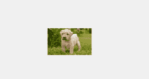
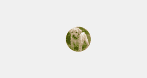
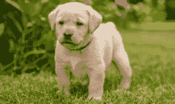
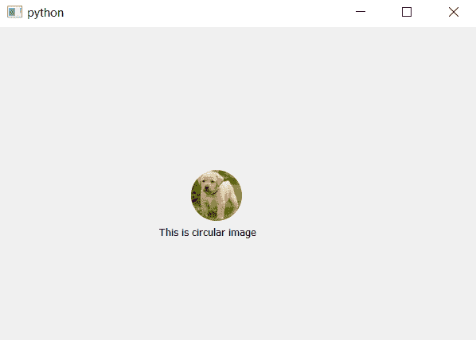

# pyqt 5–如何从任意图像创建圆形图像？

> 原文:[https://www . geeksforgeeks . org/pyqt 5-如何从任意图像创建圆形图像/](https://www.geeksforgeeks.org/pyqt5-how-to-create-circular-image-from-any-image/)

在这篇文章中，我们将看到如何显示任何宽度和高度的图像中的圆形/圆形图像

 

> **为了做到这一点，我们必须执行以下步骤:**
> 
> 1.加载图像
> 2。裁剪图像使其成为正方形
> 3。使用画师
> 4 对其进行蒙版并画圆。将其转换回位图图像

**代码:**

下图为原图:


```py
# importing libraries
from PyQt5.QtCore import * 
from PyQt5.QtGui import * 
from PyQt5.QtWidgets import *

# function to alter image
def mask_image(imgdata, imgtype ='png', size = 64):

    # Load image
    image = QImage.fromData(imgdata, imgtype)

    # convert image to 32-bit ARGB (adds an alpha
    # channel ie transparency factor):
    image.convertToFormat(QImage.Format_ARGB32)

    # Crop image to a square:
    imgsize = min(image.width(), image.height())
    rect = QRect(
        (image.width() - imgsize) / 2,
        (image.height() - imgsize) / 2,
        imgsize,
        imgsize,
     )

    image = image.copy(rect)

    # Create the output image with the same dimensions 
    # and an alpha channel and make it completely transparent:
    out_img = QImage(imgsize, imgsize, QImage.Format_ARGB32)
    out_img.fill(Qt.transparent)

    # Create a texture brush and paint a circle 
    # with the original image onto the output image:
    brush = QBrush(image)

    # Paint the output image
    painter = QPainter(out_img)
    painter.setBrush(brush)

    # Don't draw an outline
    painter.setPen(Qt.NoPen)

    # drawing circle
    painter.drawEllipse(0, 0, imgsize, imgsize)

    # closing painter event
    painter.end()

    # Convert the image to a pixmap and rescale it. 
    pr = QWindow().devicePixelRatio()
    pm = QPixmap.fromImage(out_img)
    pm.setDevicePixelRatio(pr)
    size *= pr
    pm = pm.scaled(size, size, Qt.KeepAspectRatio, 
                               Qt.SmoothTransformation)

    # return back the pixmap data
    return pm

class Window(QWidget):

    """Simple window that shows our masked image and text label."""
    def __init__(self):
        super().__init__()

        # setting up the geometry
        self.setGeometry(100, 100, 600, 400)

        # image path
        imgpath = "image.png"

        # loading image
        imgdata = open(imgpath, 'rb').read()

        # calling the function
        pixmap = mask_image(imgdata)

        # creating label
        self.ilabel = QLabel(self)

        # putting image on label
        self.ilabel.setPixmap(pixmap)

        # moving the label
        self.ilabel.move(240, 180)

        # another label to put text
        self.tlabel = QLabel('This is circular image', self)
        self.tlabel.move(200, 250)

# main function
if __name__ == '__main__':
    import sys
    from PyQt5.QtWidgets import QApplication

    # app created
    app = QApplication(sys.argv)
    w = Window()
    w.show()

    # begin the app
    sys.exit(app.exec_())
```

**输出:**
