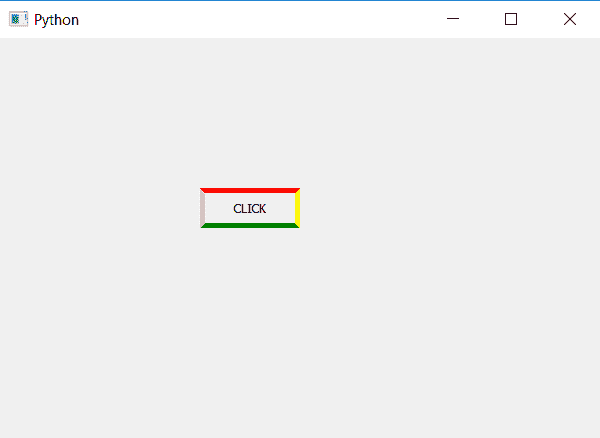

# PyQt5 |如何创建按钮的彩色边框？

> 原文:[https://www . geesforgeks . org/pyqt 5-如何创建彩色按钮边框/](https://www.geeksforgeeks.org/pyqt5-how-to-create-colorful-border-of-push-button/)

在本文中，我们将看到如何创建按钮的彩色边框。默认情况下，按钮有一个按钮，但我们也可以更改边框颜色和大小。PyQt5 允许我们在样式表的帮助下改变按钮的颜色。

> **语法:**
> 
> ```
> button.setStyleSheet("border :5px solid ;"
>                      "border-top-color : red; "
>                      "border-left-color :pink;"
>                      "border-right-color :yellow;"
>                      "border-bottom-color : green")
> 
> ```
> 
> **自变量:**它以字符串为自变量。
> 
> **执行的动作:**会给不同的边设置不同的颜色。

**代码:**

```
# importing libraries
from PyQt5.QtWidgets import * 
from PyQt5.QtGui import * 
from PyQt5.QtCore import * 
import sys

class Window(QMainWindow):
    def __init__(self):
        super().__init__()

        # setting title
        self.setWindowTitle("Python ")

        # setting geometry
        self.setGeometry(100, 100, 600, 400)

        # calling method
        self.UiComponents()

        # showing all the widgets
        self.show()

    # method for widgets
    def UiComponents(self):

        # creating a push button
        button = QPushButton("CLICK", self)

        # setting geometry of button
        button.setGeometry(200, 150, 100, 40)

        # adding action to a button
        button.clicked.connect(self.clickme)

        # creating colorful border
        button.setStyleSheet("border :5px solid ;"
                             "border-top-color : red; "
                             "border-left-color :pink;"
                             "border-right-color :yellow;"
                             "border-bottom-color : green")

    # action method
    def clickme(self):

        # printing pressed
        print("pressed")

# create pyqt5 app
App = QApplication(sys.argv)

# create the instance of our Window
window = Window()

# start the app
sys.exit(App.exec())
```

**输出:**
