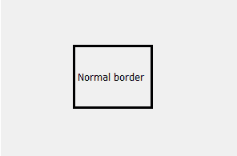
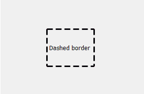

# pyqt 5–如何创建标签的虚线边框？

> 原文:[https://www . geesforgeks . org/pyqt 5-如何创建标签虚线边框/](https://www.geeksforgeeks.org/pyqt5-how-to-create-dashed-border-of-label/)

在本文中，我们将看到如何在 PyQt5 应用程序中创建标签的虚线边框。通常，当我们创建带有边框的标签时，边框是连续的，但是我们也可以创建虚线边框。下图显示了普通边框和虚线边框的区别。

 

为了做到这一点，我们将使用`setStyleSheet()`方法。

> **语法:**label .set 样式表(“边框:3px 黑色；边框样式:虚线)
> 
> **自变量:**以字符串为自变量
> 
> **执行的动作:**使边框虚线化。

**代码:**

```
# importing the required libraries

from PyQt5.QtCore import * 
from PyQt5.QtGui import * 
from PyQt5.QtWidgets import * 
import sys

class Window(QMainWindow):
    def __init__(self):
        super().__init__()

        # set the title
        self.setWindowTitle("Python")

        # setting  the geometry of window
        self.setGeometry(60, 60, 600, 400)

        # creating a label widget
        self.label_1 = QLabel("Normal border", self)

        # moving position
        self.label_1.move(100, 100)

        # setting up the border and padding
        self.label_1.setStyleSheet("border :3px solid black;")

        # resizing label
        self.label_1.resize(100, 80)

        # creating a label widget
        self.label_2 = QLabel("Dashed border", self)

        # setting up the dashed border
        self.label_2.setStyleSheet("border :3px solid black;
                                    border-style : dashed")

        # moving position
        self.label_2.move(230, 200)

        # resizing the label
        self.label_2.resize(100, 80)

        # show all the widgets
        self.show()

# create pyqt5 app
App = QApplication(sys.argv)

# create the instance of our Window
window = Window()
# start the app
sys.exit(App.exec())
```

**输出:**
