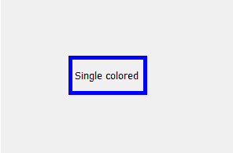
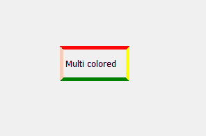
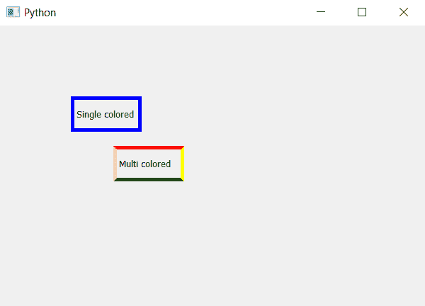

# PyQt5–如何创建多色边框标签？

> 原文:[https://www . geesforgeks . org/pyqt 5-如何创建带有多色边框的标签/](https://www.geeksforgeeks.org/pyqt5-how-to-create-label-with-multicolor-border/)

当我们创建标签的边框时，它是相同的颜色，即所有的边缘都是相同的颜色。在本文中，我们将看到如何创建多色边框，即所有的边缘都是不同的颜色。

 

为了做到这一点，我们将使用`setStyleSheet()`方法。

> **语法:**
> 
> ```
> label.setStyleSheet("border :5px solid ;"
>                     "border-top-color : red; "
>                     "border-left-color :pink;"
>                     "border-right-color :yellow;"
>                     "border-bottom-color : green")
> 
> ```
> 
> **自变量:**它以字符串为自变量。
> 
> **执行的动作:**改变每条边的颜色。

**代码:**

```
# importing the required libraries

from PyQt5.QtCore import * 
from PyQt5.QtGui import * 
from PyQt5.QtWidgets import * 
import sys

class Window(QMainWindow):
    def __init__(self):
        super().__init__()

        # set the title
        self.setWindowTitle("Python")

        # setting  the geometry of window
        self.setGeometry(60, 60, 600, 400)

        # creating a label widget
        self.label_1 = QLabel(self)

        # moving position
        self.label_1.move(100, 100)

        # setting up the border
        self.label_1.setStyleSheet("border :5px solid blue;")

        # setting label text
        self.label_1.setText("Single colored")

        # resizing label
        self.label_1.resize(100, 50)
        # creating a label widget
        self.label_2 = QLabel(self)

        # moving position
        self.label_2.move(160, 170)

        # setting up the border and changing color of each edge
        self.label_2.setStyleSheet("border :5px solid ;"
                                   "border-top-color : red; "
                                   "border-left-color :pink;"
                                   "border-right-color :yellow;"
                                   "border-bottom-color : green")

        # setting label text
        self.label_2.setText("Multi colored")
        self.label_2.resize(100, 50)

        # show all the widgets
        self.show()

# create pyqt5 app
App = QApplication(sys.argv)

# create the instance of our Window
window = Window()
# start the app
sys.exit(App.exec())
```

**输出:**
