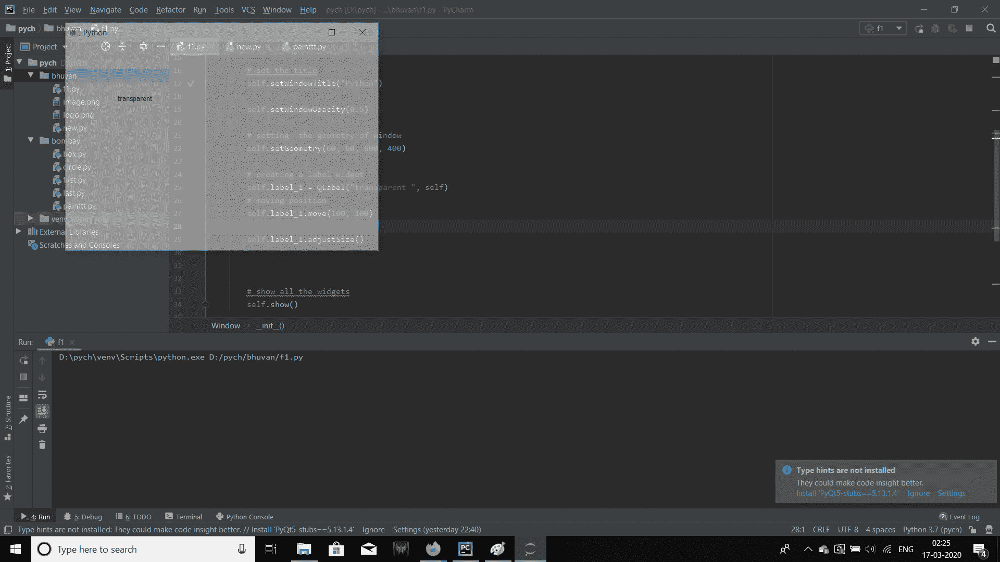

# PyQt5–如何创建半透明窗口？

> 原文:[https://www . geesforgeks . org/pyqt 5-如何创建-半透明-窗口/](https://www.geeksforgeeks.org/pyqt5-how-to-create-semi-transparent-window/)

当我们在 PyQt5 中设计一个应用程序时，默认情况下，主窗口是不透明的，但是我们也可以使它透明。我们可以通过使用属于`QWidget class`的`setWindowOpacity()`方法来做到这一点。

> **语法：** 设置窗口不透明度（0.5）
> 
> **自变量:**取浮点值作为自变量:0 表示完全透明，1 表示不透明。
> 
> **执行的操作:**使窗口透明。

**代码:**

```
# importing the required libraries

from PyQt5.QtCore import * 
from PyQt5.QtGui import * 
from PyQt5.QtWidgets import * 
import sys

class Window(QMainWindow):

    def __init__(self):
        super().__init__()

        # set the title
        self.setWindowTitle("Python")

        self.setWindowOpacity(0.5)

        # setting  the geometry of window
        self.setGeometry(60, 60, 600, 400)

        # creating a label widget
        self.label_1 = QLabel("transparent ", self)
        # moving position
        self.label_1.move(100, 100)

        self.label_1.adjustSize()

        # show all the widgets
        self.show()

# create pyqt5 app
App = QApplication(sys.argv)

# create the instance of our Window
window = Window()

# start the app
sys.exit(App.exec())
```

**输出:**
