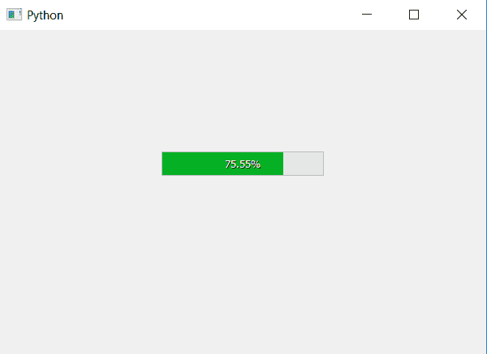

# PyQt5 |如何在进度条中显示小数值？

> 原文:[https://www . geesforgeks . org/pyqt 5-如何显示十进制数值进度条/](https://www.geeksforgeeks.org/pyqt5-how-to-display-decimal-values-in-progress-bar/)

在本文中，我们将看到如何在进度条中显示十进制值。我们可以使用`setValue`方法在进度条中设置值，但它以整数为参数。如果我们试图传递浮点或双精度值，它会自动将它们转换为整数。

**为了做到这一点，我们必须做到以下几点:**

1.  更改进度条的最大范围值，默认为 0 到 100。如果我们想显示 1 个小数值，将其设置为 100*n，这里的“n”将是 10，如果我们想显示 2 个小数值，将其设置为 100*n，这里的 n 将是 100，以此类推。
2.  通过将进度条乘以“n”来设置进度条的值。
3.  使用 format 方法显示十进制值。

下面是实现。

```
# importing libraries
from PyQt5.QtWidgets import * 
from PyQt5 import QtCore, QtGui
from PyQt5.QtGui import * 
from PyQt5.QtCore import * 
import sys

class Window(QMainWindow):

    def __init__(self):
        super().__init__()

        # setting title
        self.setWindowTitle("Python ")

        # setting geometry
        self.setGeometry(100, 100, 600, 400)

        # calling method
        self.UiComponents()

        # showing all the widgets
        self.show()

    # method for widgets
    def UiComponents(self):

        # creating progress bar
        bar = QProgressBar(self)

        # setting geometry to progress bar
        bar.setGeometry(200, 150, 200, 30)

        # setting value of n for 2 decimal values
        n = 100

        # setting maximum value for 2 decimal points
        bar.setMaximum(100 * n)

        # value in percentage
        value = 75.55

        # setting the value by multiplying it to 100
        bar.setValue(value * n)

        # displaying the decimal value
        bar.setFormat("%.02f %%" % value)

        # setting alignment to centre
        bar.setAlignment(Qt.AlignCenter)    

# create pyqt5 app
App = QApplication(sys.argv)

# create the instance of our Window
window = Window()

# start the app
sys.exit(App.exec())
```

**输出:**
