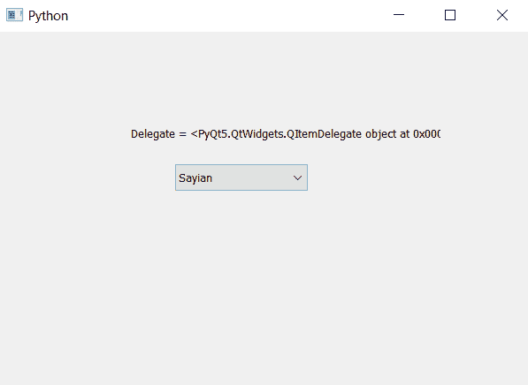

# PyQt5–如何在组合框

中获取项目委托

> 原文:[https://www . geeksforgeeks . org/pyqt 5-如何获取项目-委托-in-combobox/](https://www.geeksforgeeks.org/pyqt5-how-to-get-item-delegate-in-combobox/)

在本文中，我们将看到如何在组合框中获取项目委托。Delegate 基本上是一个默认的安全类型对象，被组合框用来指向另一个函数我们可以借助`setItemDelegate`方法改变组合框的 delegate 对象

为了获得组合框的委托对象，我们将使用`itemDelegate()`方法

> **语法:**组合框 _ item delegate()
> 
> **论证:**不需要论证
> 
> **返回**返回 QItemDelegate 对象

下面是实现

```
# importing libraries
from PyQt5.QtWidgets import * 
from PyQt5 import QtCore, QtGui
from PyQt5.QtGui import * 
from PyQt5.QtCore import * 
import sys

class Window(QMainWindow):

    def __init__(self):
        super().__init__()

        # setting title
        self.setWindowTitle("Python ")

        # setting geometry
        self.setGeometry(100, 100, 600, 400)

        # calling method
        self.UiComponents()

        # showing all the widgets
        self.show()

    # method for widgets
    def UiComponents(self):

        # creating a combo box widget
        self.combo_box = QComboBox(self)

        # setting geometry of combo box
        self.combo_box.setGeometry(200, 150, 150, 30)

        # geek list
        geek_list = ["Sayian", "Super Saiyan", "Super Sayian 2", "Super Sayian B"]

        # adding list of items to combo box
        self.combo_box.addItems(geek_list)

        # getting delegate
        delegate = self.combo_box.itemDelegate()

        # creating label to show delegate
        label = QLabel("Delegate = " + str(delegate), self)

        # setting geometry of the label
        label.setGeometry(150, 100, 350, 30)

# create pyqt5 app
App = QApplication(sys.argv)

# create the instance of our Window
window = Window()

# start the app
sys.exit(App.exec())
```

**输出:**
