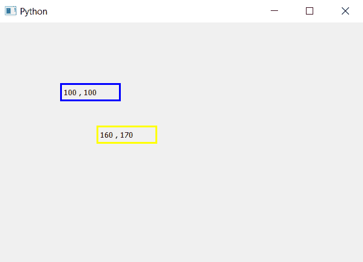

# pyqt 5–如何获取标签坐标？

> 原文:[https://www . geesforgeks . org/pyqt 5-如何获取标签-坐标/](https://www.geeksforgeeks.org/pyqt5-how-to-get-label-coordinates/)

PyQt5 中的主窗口类似于图形，它有 x 轴和 y 轴，所有的小部件都是根据它们的 x，y 坐标定位的。当我们创建的标签形成在左上角时，op 的左坐标是(0，0)，我们可以使用`move()`方法移动标签。
在本文中，我们将看到如何获得标签的坐标。为此，我们将使用`x()`方法进行 x 坐标，使用`y()`方法进行 y 坐标。

> **语法:**
> 
> ```py
> x_position = label.x()
> y_position =label.y()
> 
> ```
> 
> **参数:**两种方法都不需要参数。
> 
> **返回:**均返回整数。

**代码:**

```py
# importing the required libraries

from PyQt5.QtCore import * 
from PyQt5.QtGui import * 
from PyQt5.QtWidgets import * 
import sys

class Window(QMainWindow):

    def __init__(self):
        super().__init__()

        # set the title
        self.setWindowTitle("Python")

        # setting  the geometry of window
        self.setGeometry(60, 60, 600, 400)

        # creating a label widget
        self.label_1 = QLabel(self)

        # moving position
        self.label_1.move(100, 100)

        # setting up the border
        self.label_1.setStyleSheet("border :3px solid blue;")

        # getting x and y co-ordinates
        x = str(self.label_1.x())
        y = str(self.label_1.y())

        # setting label text
        self.label_1.setText(x+", "+ y)

        # creating a label widget
        self.label_2 = QLabel(self)

        # moving position
        self.label_2.move(160, 170)

        # setting up the border
        self.label_2.setStyleSheet("border :3px solid yellow;")

        # getting x and y co-ordinates
        x = str(self.label_2.x())
        y = str(self.label_2.y())

        # setting label text
        self.label_2.setText(x + ", " + y)

        # show all the widgets
        self.show()

# create pyqt5 app
App = QApplication(sys.argv)

# create the instance of our Window
window = Window()
# start the app
sys.exit(App.exec())
```

**输出:**
