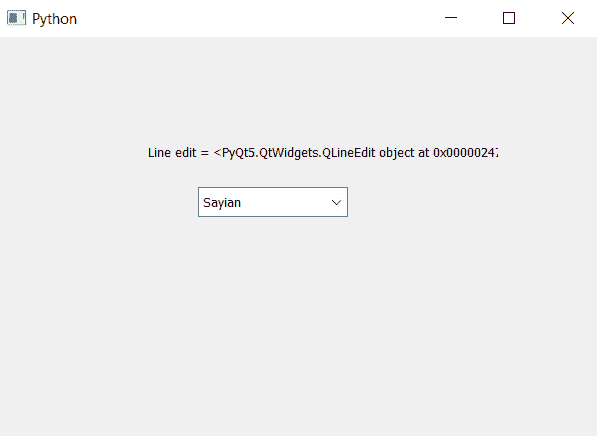

# PyQt5–如何获得组合框

的线条编辑

> 原文:[https://www . geeksforgeeks . org/pyqt 5-如何获得-line-edit-of-combobox/](https://www.geeksforgeeks.org/pyqt5-how-to-get-line-edit-of-combobox/)

在本文中，我们将看到如何获得组合框的行编辑，行编辑基本上是我们插入文本的组合框的默认对象，它被组合框用来显示所选的选项，为了获得输入，我们可以借助`setLineEdit`方法获得组合框的行编辑对象

为了获得组合框的委托对象，我们将使用`lineEdit`方法

> **语法:**组合框. lineEdit()
> 
> **论证:**不需要论证
> 
> **返回**它返回 QLineEdit 对象

以下是实施–

```
# importing libraries
from PyQt5.QtWidgets import * 
from PyQt5 import QtCore, QtGui
from PyQt5.QtGui import * 
from PyQt5.QtCore import * 
import sys

class Window(QMainWindow):

    def __init__(self):
        super().__init__()

        # setting title
        self.setWindowTitle("Python ")

        # setting geometry
        self.setGeometry(100, 100, 600, 400)

        # calling method
        self.UiComponents()

        # showing all the widgets
        self.show()

    # method for widgets
    def UiComponents(self):

        # creating a combo box widget
        self.combo_box = QComboBox(self)

        # setting geometry of combo box
        self.combo_box.setGeometry(200, 150, 150, 30)

        # geek list
        geek_list = ["Sayian", "Super Saiyan", "Super Sayian 2", "Super Sayian B"]

        # adding list of items to combo box
        self.combo_box.addItems(geek_list)

        # creating a line edit
        edit = QLineEdit(self)

        # setting line edit
        self.combo_box.setLineEdit(edit)

        # getting line edit
        line = self.combo_box.lineEdit()

        # creating label to show delegate
        label = QLabel("Line edit = " + str(line), self)

        # setting geometry of the label
        label.setGeometry(150, 100, 350, 30)

# create pyqt5 app
App = QApplication(sys.argv)

# create the instance of our Window
window = Window()

# start the app
sys.exit(App.exec())
```

**输出:**
