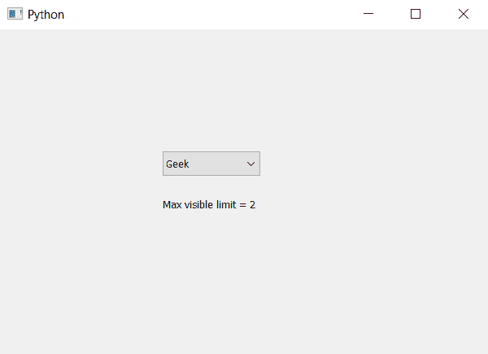

# PyQt5–如何在组合框

中获得最大可见项目数

> 原文:[https://www . geesforgeks . org/pyqt 5-如何获得最大可见项目数组合框/](https://www.geeksforgeeks.org/pyqt5-how-to-get-number-of-maximum-visible-items-in-combobox/)

在本文中，我们将看到如何获得组合框的最大可见项目数。默认情况下，在组合框下拉列表中一次最多可以看到 10 个项目，尽管我们可以更改这个数字。`setMaxVisibleItems`方法用于设置最大可见项目的限制。

为了获得最大可见项目数，我们使用`maxVisibleItems`方法

> **语法:**组合框
> 
> **论证:**不需要论证
> 
> **返回:**返回整数

以下是实施–

```
# importing libraries
from PyQt5.QtWidgets import * 
from PyQt5 import QtCore, QtGui
from PyQt5.QtGui import * 
from PyQt5.QtCore import * 
import sys

class Window(QMainWindow):

    def __init__(self):
        super().__init__()

        # setting title
        self.setWindowTitle("Python ")

        # setting geometry
        self.setGeometry(100, 100, 600, 400)

        # calling method
        self.UiComponents()

        # showing all the widgets
        self.show()

    # method for widgets
    def UiComponents(self):

        # creating a combo box widget
        self.combo_box = QComboBox(self)

        # setting geometry of combo box
        self.combo_box.setGeometry(200, 150, 120, 30)

        # geek list
        geek_list = ["Geek", "Geeky Geek", "Legend Geek", "Ultra Legend Geek"]

        # adding list of items to combo box
        self.combo_box.addItems(geek_list)

        # setting max number visible limit
        self.combo_box.setMaxVisibleItems(2)

        # getting maximum visible limit
        limit = self.combo_box.maxVisibleItems()

        # creating label to show the count
        label = QLabel("Max visible limit = " + str(limit), self)

        # setting label geometry
        label.setGeometry(200, 200, 200, 30)

# create pyqt5 app
App = QApplication(sys.argv)

# create the instance of our Window
window = Window()

# start the app
sys.exit(App.exec())
```

**输出:**
