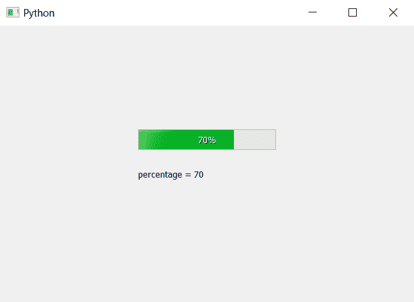

# PyQt5–如何获得进度条的百分比？

> 原文:[https://www . geeksforgeeks . org/pyqt 5-如何获得进度条百分比/](https://www.geeksforgeeks.org/pyqt5-how-to-get-percentage-of-progress-bar/)

在本文中我们将看到如何获取进度条的百分比值，我们可以使用`setValue`方法设置进度条的百分比。为了得到百分比值，我们使用`text`方法，该方法将返回表示百分比的整数。

> **语法:** bar.text()
> 
> **论证:**不需要论证。
> 
> **返回:**返回整数。

下面是实现。

```
# importing libraries
from PyQt5.QtWidgets import * 
from PyQt5 import QtCore, QtGui
from PyQt5.QtGui import * 
from PyQt5.QtCore import * 
import sys

class Window(QMainWindow):

    def __init__(self):
        super().__init__()

        # setting title
        self.setWindowTitle("Python ")

        # setting geometry
        self.setGeometry(100, 100, 600, 400)

        # calling method
        self.UiComponents()

        # showing all the widgets
        self.show()

    # method for widgets
    def UiComponents(self):

        # creating progress bar
        bar = QProgressBar(self)

        # setting geometry to progress bar
        bar.setGeometry(200, 150, 200, 30)

        # set value to progress bar
        bar.setValue(70)

        # getting percentage value
        p_value = bar.text()

        # creating label to print percentage
        label = QLabel("percentage = " + str(p_value), self)

        # moving the label
        label.move(200, 200)

        # setting alignment to centre
        bar.setAlignment(Qt.AlignCenter)

# create pyqt5 app
App = QApplication(sys.argv)

# create the instance of our Window
window = Window()

# start the app
sys.exit(App.exec())
```

**输出:**
