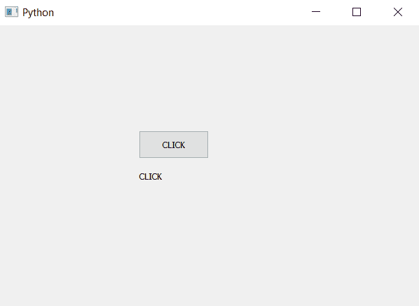

# PyQt5 |如何获取按钮的文本？

> 原文:[https://www . geesforgeks . org/pyqt 5-如何获取按钮文本/](https://www.geeksforgeeks.org/pyqt5-how-to-get-the-text-of-push-button/)

在本文中，我们将看到如何获取按钮的文本。当我们创建按钮时，我们给它设置一些在主窗口中可见的文本，我们可以使用文本方法检索文本。

> **语法:** button.text()
> **参数:**不需要参数。
> **返回:**返回字符串。

**代码:**

## 蟒蛇 3

```py
# importing libraries
from PyQt5.QtWidgets import *
from PyQt5.QtGui import *
from PyQt5.QtCore import *
import sys

class Window(QMainWindow):
    def __init__(self):
        super().__init__()

        # setting title
        self.setWindowTitle("Python ")

        # setting geometry
        self.setGeometry(100, 100, 600, 400)

        # calling method
        self.UiComponents()

        # showing all the widgets
        self.show()

    # method for widgets
    def UiComponents(self):

        # creating a push button
        button = QPushButton("CLICK", self)

        # setting geometry of button
        button.setGeometry(200, 150, 100, 40)

        # adding action to a button
        button.clicked.connect(self.clickme)

        # getting text in button
        text = button.text()

        # creating label to print text
        label = QLabel(text, self)
        label.move(200, 200)

    # action method
    def clickme(self):

        # printing pressed
        print("pressed")

# create pyqt5 app
App = QApplication(sys.argv)

# create the instance of our Window
window = Window()

# start the app
sys.exit(App.exec())
```

**输出:**

