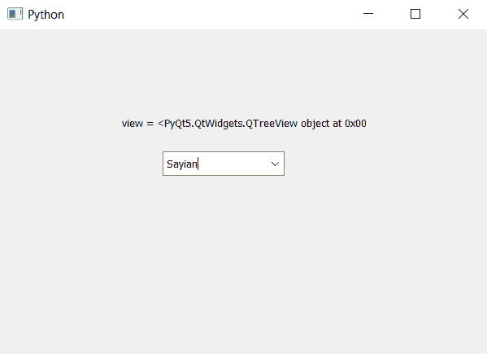

# PyQt5–如何查看组合框

> 原文:[https://www . geeksforgeeks . org/pyqt 5-如何获得组合框视图/](https://www.geeksforgeeks.org/pyqt5-how-to-get-the-view-of-the-combobox/)

在本文中，我们将了解如何查看组合框。视图主要帮助我们改变下拉列表的视图。为了设置组合框的视图，我们将使用`setView`方法。为了获得视图，我们使用`view`方法。

> **语法:**组合框.视图()
> 
> **论证:**不需要论证
> 
> **返回:**将返回视图类型对象

以下是实施–

```py
# importing libraries
from PyQt5.QtWidgets import * 
from PyQt5 import QtCore, QtGui
from PyQt5.QtGui import * 
from PyQt5.QtCore import * 
import sys

class Window(QMainWindow):

    def __init__(self):
        super().__init__()

        # setting title
        self.setWindowTitle("Python ")

        # setting geometry
        self.setGeometry(100, 100, 600, 400)

        # calling method
        self.UiComponents()

        # showing all the widgets
        self.show()

    # method for widgets
    def UiComponents(self):

        # creating a combo box widget
        self.combo_box = QComboBox(self)

        # setting geometry of combo box
        self.combo_box.setGeometry(200, 150, 150, 30)

        # geek list
        geek_list = ["Sayian", "Super Saiyan", "Super Sayian 2", 
                                               "Super Sayian B"]

        # making it editable
        self.combo_box.setEditable(True)

        # creating a view
        view = QTreeView()

        # setting view to combo box
        self.combo_box.setView(view)

        # adding list of items to combo box
        self.combo_box.addItems(geek_list)

        # getting view
        get_view = self.combo_box.view()

        # creating label to dhow the view object
        label = QLabel("view = " + str(get_view), self)

        # setting geometry of the label
        label.setGeometry(150, 100, 300, 30)

# create pyqt5 app
App = QApplication(sys.argv)

# create the instance of our Window
window = Window()

# start the app
sys.exit(App.exec())
```

**输出:**
