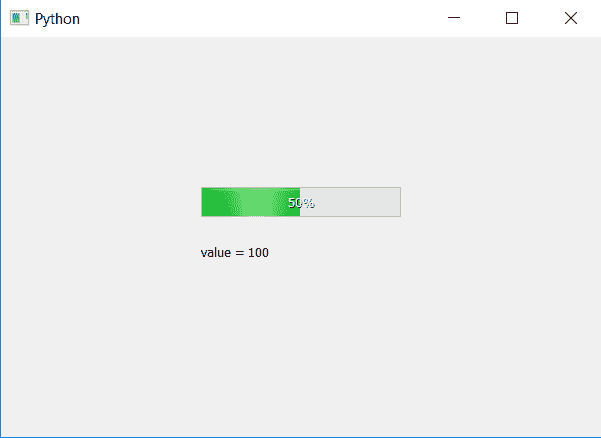

# PyQt5–如何获取进度条的值？

> 原文:[https://www . geesforgeks . org/pyqt 5-如何获得进度条价值/](https://www.geeksforgeeks.org/pyqt5-how-to-get-value-of-progress-bar/)

在本文中，我们将看到如何获得进度条的价值。过程条的值基本上用来设置过程条的百分比。

**注意:**进度条的百分比和值都是不同的东西，它们可以有相同的值，但是百分比取决于进度条的范围和进度条的值，如果进度条的范围是从 0 到 100，那么百分比值将等于进度条的值。

为了得到过程条的值，我们将使用`value`方法。

> **语法:** bar.value()
> 
> **论证:**不需要论证。
> 
> **返回:**返回整数值。

下面是实现。

```
# importing libraries
from PyQt5.QtWidgets import * 
from PyQt5 import QtCore, QtGui
from PyQt5.QtGui import * 
from PyQt5.QtCore import * 
import sys

class Window(QMainWindow):

    def __init__(self):
        super().__init__()

        # setting title
        self.setWindowTitle("Python ")

        # setting geometry
        self.setGeometry(100, 100, 600, 400)

        # calling method
        self.UiComponents()

        # showing all the widgets
        self.show()

    # method for widgets
    def UiComponents(self):

        # creating progress bar
        bar = QProgressBar(self)

        # setting geometry to progress bar
        bar.setGeometry(200, 150, 200, 30)

        # setting maximum value of progress bar to 1000
        bar.setMaximum(200)

        # setting value to progress bar
        bar.setValue(100)

        # getting value of progress bar
        value = bar.value()

        # creating label to print the value
        label = QLabel("value = " + str(value), self)

        # moving the label
        label.move(200, 200)

        # setting alignment to centre
        bar.setAlignment(Qt.AlignCenter)

# create pyqt5 app
App = QApplication(sys.argv)

# create the instance of our Window
window = Window()

# start the app
sys.exit(App.exec())
```

**输出:**
