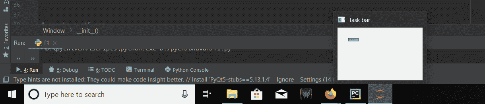
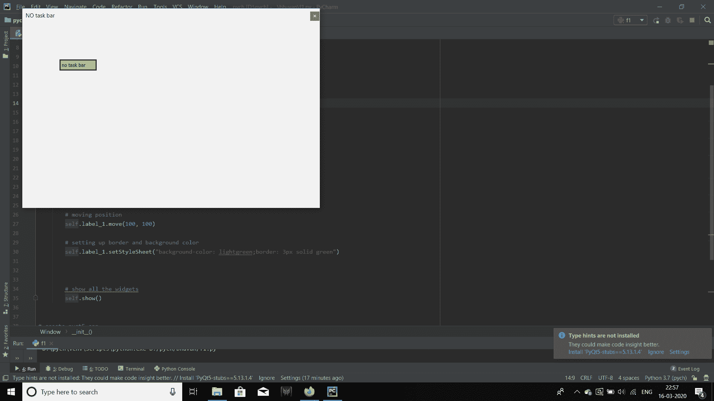

# pyqt 5–如何从任务栏隐藏 app？

> 原文:[https://www . geesforgeks . org/pyqt 5-如何从任务栏隐藏应用程序/](https://www.geeksforgeeks.org/pyqt5-how-to-hide-app-from-taskbar/)

创建 PyQt5 应用程序时，窗口会打开，在任务栏中，应用程序会自动出现，当我们关闭应用程序时，它会被移除。


**任务栏**是图形用户界面的一个元素，具有各种用途。它通常显示哪些程序当前正在运行。任务栏的具体设计和布局因各个操作系统而异，但通常呈现为位于屏幕一边的条形。

在本文中我们将看到如何隐藏任务栏中的应用程序，为了做到这一点，我们将使用`setWindowFlag()`方法并传递属于`QWidget class`的应用程序。

> **语法 ：** setWindowFlag（QtCore.Qt.Tool）
> 
> **自变量:**以 Window 类型为自变量。
> 
> **执行的操作:**它在任务栏中隐藏应用程序。

**代码:**

```py
# importing the required libraries

from PyQt5.QtWidgets import * 
from PyQt5.QtGui import * 
from PyQt5 import QtCore
import sys

class Window(QMainWindow):
    def __init__(self):
        super().__init__()

        # this will hide the app from task bar
        self.setWindowFlag(QtCore.Qt.Tool)

        # set the title
        self.setWindowTitle("NO task bar")

        # setting  the geometry of window
        self.setGeometry(60, 60, 800, 500)

        # creating a label widget
        # by default label will display at top left corner
        self.label_1 = QLabel('no task bar', self)

        # moving position
        self.label_1.move(100, 100)

        # setting up border and background color
        self.label_1.setStyleSheet("background-color: lightgreen;
                                    border: 3px solid green")

        # show all the widgets
        self.show()

# create pyqt5 app
App = QApplication(sys.argv)

# create the instance of our Window
window = Window()
# start the app
sys.exit(App.exec())
```

**输出:**
