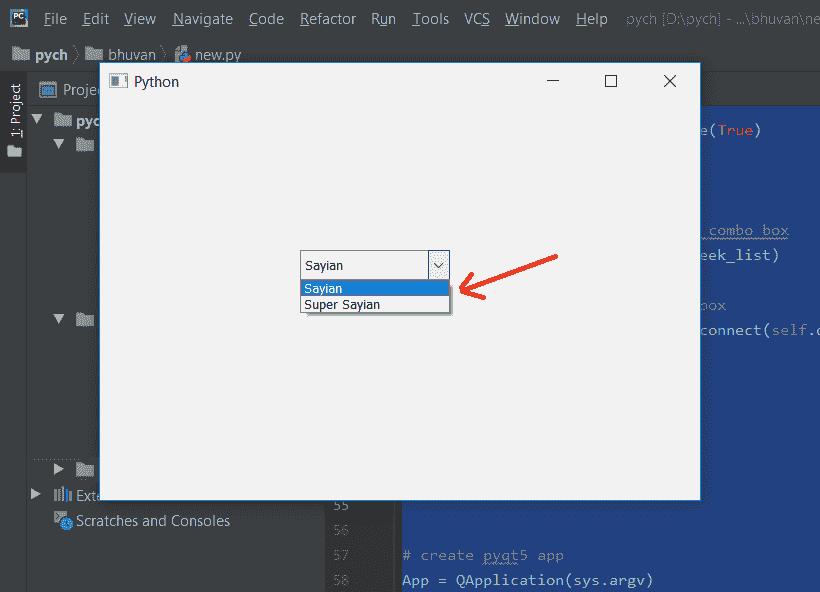
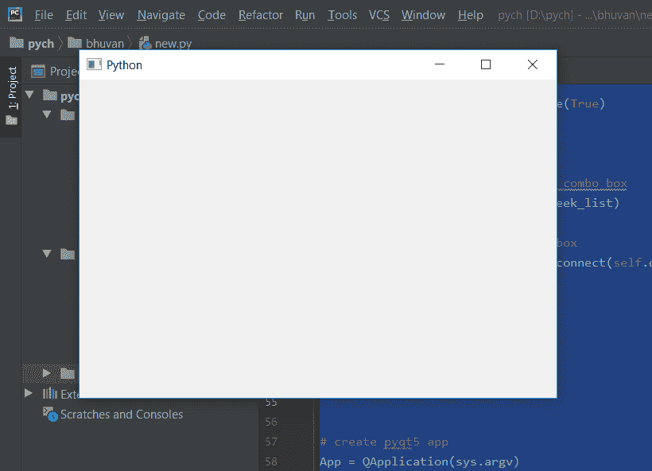

# PyQt5–如何在选择新项目时隐藏组合框

> 原文:[https://www . geesforgeks . org/pyqt 5-如何隐藏-组合框-当新项目被选中时/](https://www.geeksforgeeks.org/pyqt5-how-to-hide-combobox-when-new-item-get-selected/)

在本文中，我们将看到如何在选择任何其他项目时隐藏它们的组合框。有时候，当组合框的需求得到满足时，它应该被移除，但是移除它将不允许我们重用它，因此隐藏它是一个更好的选择。

> **为了在选择项目时隐藏组合框，我们必须执行以下操作–**
> 
> 1.创建组合框
> 2。将项目添加到组合框
> 3。向组合框
> 4 添加动作。在组合框内借助`hide`方法隐藏组合框

下面是实现

```py
# importing libraries
from PyQt5.QtWidgets import * 
from PyQt5 import QtCore, QtGui
from PyQt5.QtGui import * 
from PyQt5.QtCore import * 
import sys

class Window(QMainWindow):

    def __init__(self):
        super().__init__()

        # setting title
        self.setWindowTitle("Python ")

        # setting geometry
        self.setGeometry(100, 100, 600, 400)

        # calling method
        self.UiComponents()

        # showing all the widgets
        self.show()

    # method for widgets
    def UiComponents(self):

        # creating a combo box widget
        self.combo_box = QComboBox(self)

        # setting geometry of combo box
        self.combo_box.setGeometry(200, 150, 150, 30)

        # geek list
        geek_list = ["Sayian", "Super Sayian"]

        # making it editable
        self.combo_box.setEditable(True)

        # adding list of items to combo box
        self.combo_box.addItems(geek_list)

        # adding action to combo box
        self.combo_box.activated.connect(self.do_something)

    # method called by combo box
    def do_something(self):

        # hiding the combo box
        self.combo_box.hide()

# create pyqt5 app
App = QApplication(sys.argv)

# create the instance of our Window
window = Window()

# start the app
sys.exit(App.exec())
```

**输出:**


选择任意项目后–
