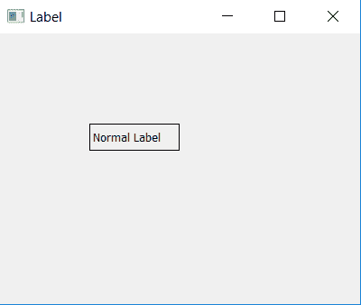

# PyQt5–如何隐藏标签| label.setHidden 方法

> 原文:[https://www . geesforgeks . org/pyqt 5-如何隐藏-标签-标签-sethidden-method/](https://www.geeksforgeeks.org/pyqt5-how-to-hide-label-label-sethidden-method/)

在本文中，我们将看到如何在 PyQt5 应用程序中隐藏标签。标签是在窗体上显示文本的图形控件元素。它通常是静态控件；没有交互性。标签通常用于标识附近的文本框或其他小部件。

为了隐藏标签，我们使用`setHidden()`方法，该方法允许用户设置小部件是应该可见还是隐藏，它属于`QWidget class`。

> **语法:**标签。设置隐藏(真)
> 
> **自变量:**它以布尔为自变量。

**代码:**

```
# importing the required libraries

from PyQt5.QtWidgets import *
from PyQt5 import QtCore
from PyQt5.QtGui import * 
import sys

class Window(QMainWindow):
    def __init__(self):
        super().__init__()

        # set the title
        self.setWindowTitle("Label")

        # setting  the geometry of window
        self.setGeometry(0, 0, 400, 300)

        # creating a label widget
        self.label_1 = QLabel("Normal Label", self)

        # moving position
        self.label_1.move(100, 100)

        # setting up border
        self.label_1.setStyleSheet("border: 1px solid black;")

        # creating a label widget
        self.label_2 = QLabel("Hidden Label", self)

        # moving position
        self.label_2.move(100, 150)

        # setting up border
        self.label_2.setStyleSheet("border: 1px solid black;")

        # hiding the label
        self.label_2.setHidden(True)

        # show all the widgets
        self.show()

# create pyqt5 app
App = QApplication(sys.argv)

# create the instance of our Window
window = Window()

# start the app
sys.exit(App.exec())
```

**输出:**

如我们所见标签 2 隐藏在输出窗口中。