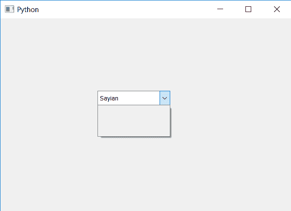

# PyQt5–如何隐藏组合框

下拉框中的项目

> 原文:[https://www . geesforgeks . org/pyqt 5-如何隐藏组合框中的下拉列表框中的项目/](https://www.geeksforgeeks.org/pyqt5-how-to-hide-the-items-from-drop-down-box-in-combo-box/)

在本文中，我们将看到如何从下拉框(即视图框)中隐藏组合框的项目。为了做到这一点，我们必须得到组合框的视图对象，并且必须隐藏它。

> **为了隐藏物品，我们必须执行以下步骤–**
> 
> 1.创建组合框
> 2。向组合框
> 3 添加项目。获取组合框
> 4 的查看对象。隐藏视图对象

**语法:**

```py
# getting view part of combo box
view = self.combo_box.view()

# hiding the view part
view.setHidden(True)

```

下面是实现

```py
# importing libraries
from PyQt5.QtWidgets import * 
from PyQt5 import QtCore, QtGui
from PyQt5.QtGui import * 
from PyQt5.QtCore import * 
import sys

class Window(QMainWindow):

    def __init__(self):
        super().__init__()

        # setting title
        self.setWindowTitle("Python ")

        # setting geometry
        self.setGeometry(100, 100, 600, 400)

        # calling method
        self.UiComponents()

        # showing all the widgets
        self.show()

    # method for widgets
    def UiComponents(self):

        # creating a combo box widget
        self.combo_box = QComboBox(self)

        # setting geometry of combo box
        self.combo_box.setGeometry(200, 150, 150, 30)

        # geek list
        geek_list = ["Sayian", "Super Sayian", "Super Sayian 2", "Super Sayian B"]

        # making it editable
        self.combo_box.setEditable(True)

        # adding list of items to combo box
        self.combo_box.addItems(geek_list)

        # getting view part of combo box
        view = self.combo_box.view()

        # making view box hidden
        view.setHidden(True)

# create pyqt5 app
App = QApplication(sys.argv)

# create the instance of our Window
window = Window()

# start the app
sys.exit(App.exec())
```

**输出:**
