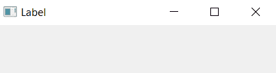
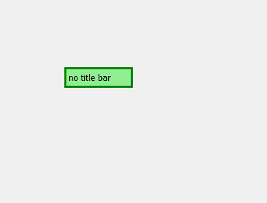

# PyQt5–如何隐藏窗口标题栏？

> 原文:[https://www . geeksforgeeks . org/pyqt 5-如何隐藏窗口标题栏/](https://www.geeksforgeeks.org/pyqt5-how-to-hide-the-title-bar-of-window/)

当我们使用 PyQt5 设计图形用户界面应用程序时，会出现窗口。窗口是计算机监视器上显示的(通常是)矩形部分，它呈现的内容(例如，目录、文本文件或图像的内容)似乎独立于屏幕的其余部分。窗口是构成图形用户界面的元素之一。

在一个窗口中，我们可以看到有一个标题栏，它包括左边的图标和标题，右边是控制按钮。


在本文中，我们将看到如何隐藏标题栏。为此我们将使用`setWindowFlag()`方法并通过属于`QWidget class`的。

> **语法：** setWindowFlag（Qt.FramelessWindowHint）
> 
> **自变量:**以 Window 类型为自变量。
> 
> **执行的动作:**移除标题栏。

**代码:**

```
# importing the required libraries

from PyQt5.QtWidgets import * 
from PyQt5.QtGui import * 
from PyQt5.QtCore import Qt
import sys

class Window(QMainWindow):
    def __init__(self):
        super().__init__()

        # this will hide the title bar
        self.setWindowFlag(Qt.FramelessWindowHint)

        # set the title
        self.setWindowTitle("no title")

        # setting  the geometry of window
        self.setGeometry(100, 100, 400, 300)

        # creating a label widget
        # by default label will display at top left corner
        self.label_1 = QLabel('no title bar', self)

        # moving position
        self.label_1.move(100, 100)

        # setting up border and background color
        self.label_1.setStyleSheet("background-color: lightgreen;
                                    border: 3px solid green")

        # show all the widgets
        self.show()

# create pyqt5 app
App = QApplication(sys.argv)

# create the instance of our Window
window = Window()
# start the app
sys.exit(App.exec())
```

**输出:**
