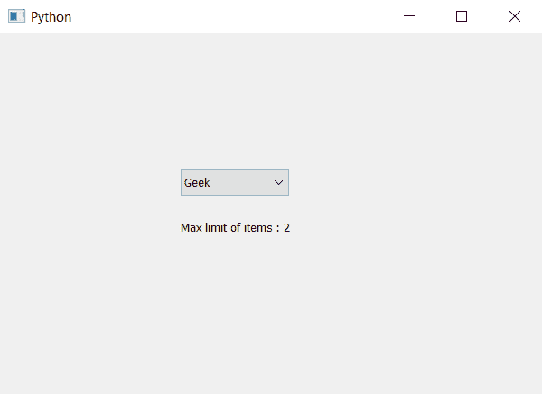

# PyQt5–如何知道组合框

中的最大项目数限制

> 原文:[https://www . geeksforgeeks . org/pyqt 5-如何知道最大项目数-组合框中的限制/](https://www.geeksforgeeks.org/pyqt5-how-to-know-maximum-number-of-items-limit-in-combobox/)

在本文中，我们将了解如何知道组合框中项目的最大数量限制。当我们创建一个组合框时，没有对项目设置限制，我们可以添加任意数量的项目，尽管有时会出现对项目设置最大限制的情况。为了设置物品数量的最大限制，我们使用`setMaxCount`方法。

为了知道最大极限，我们使用`maxCount`方法。

> **语法:**组合框 _ maxcount()
> 
> **论证:**不需要论证
> 
> **返回:**返回整数

以下是实施–

```
# importing libraries
from PyQt5.QtWidgets import * 
from PyQt5 import QtCore, QtGui
from PyQt5.QtGui import * 
from PyQt5.QtCore import * 
import sys

class Window(QMainWindow):

    def __init__(self):
        super().__init__()

        # setting title
        self.setWindowTitle("Python ")

        # setting geometry
        self.setGeometry(100, 100, 600, 400)

        # calling method
        self.UiComponents()

        # showing all the widgets
        self.show()

    # method for widgets
    def UiComponents(self):

        # creating a combo box widget
        self.combo_box = QComboBox(self)

        # setting geometry of combo box
        self.combo_box.setGeometry(200, 150, 120, 30)

        # geek list
        geek_list = ["Geek", "Geeky Geek", "Legend Geek", "Ultra Legend Geek"]

        # adding list of items to combo box
        self.combo_box.addItems(geek_list)

        # setting maximum number limit of items
        self.combo_box.setMaxCount(2)

        # getting max number limit
        limit = self.combo_box.maxCount()

        # creating label to show the limit
        label = QLabel("Max limit of items : " + str(limit), self)

        # setting geometry of label
        label.setGeometry(200, 200, 250, 30)

# create pyqt5 app
App = QApplication(sys.argv)

# create the instance of our Window
window = Window()

# start the app
sys.exit(App.exec())
```

**输出:**
