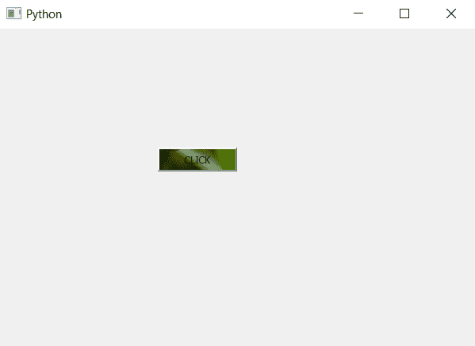

# pyqt 5–如何制作带图像的按钮？

> 原文:[https://www . geesforgeks . org/pyqt 5-如何用图像制作按钮/](https://www.geeksforgeeks.org/pyqt5-how-to-make-a-button-with-image/)

在本文中，我们将看到如何创建一个带有图像的按钮。与只存在于左侧的图标不同，我们将创建一个用图像覆盖的按钮。为此，我们将使用`setStyleSheet`方法将图像添加到按钮的背景中。

下面是普通按钮和带有图像的按钮的外观。
 

> **语法:**button .set 样式表(“背景-图像:URL(image . png)；”)
> 
> **自变量:**它以字符串为自变量。
> 
> **执行的动作:**设置按钮的背景图像。

**代码:**

```py
# importing libraries
from PyQt5.QtWidgets import * 
from PyQt5.QtGui import * 
from PyQt5.QtCore import * 
import sys

class Window(QMainWindow):
    def __init__(self):
        super().__init__()

        # setting title
        self.setWindowTitle("Python ")

        # setting geometry
        self.setGeometry(100, 100, 600, 400)

        # calling method
        self.UiComponents()

        # showing all the widgets
        self.show()

    # method for widgets
    def UiComponents(self):

        # creating a push button
        button = QPushButton("CLICK", self)

        # setting geometry of button
        button.setGeometry(200, 150, 100, 30)

        # adding action to a button
        button.clicked.connect(self.clickme)

        # setting image to the button
        button.setStyleSheet("background-image : url(image.png);")

    # action method
    def clickme(self):

        # printing pressed
        print("pressed")

# create pyqt5 app
App = QApplication(sys.argv)

# create the instance of our Window
window = Window()

# start the app
sys.exit(App.exec())
```

**输出:**
