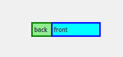
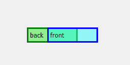
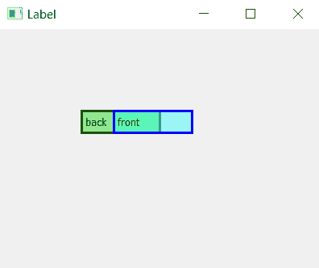

# pyqt 5–如何制作半透明标签？

> 原文:[https://www . geesforgeks . org/pyqt 5-如何制作半透明标签/](https://www.geeksforgeeks.org/pyqt5-how-to-make-semi-transparent-label/)

在设计图形用户界面应用程序时，我们倾向于制作许多标签，但有时一些标签相互重叠，只有顶部的标签才可见，这就是为什么需要半透明标签的原因。

**普通标签 vs 半透明标签–**


为了创建半透明标签`setStyleSheet()`方法被使用。

> **语法:**标签。设置样式表(“背景色:rgba(255，255，255，10)；”)
> 这里我们使用`RGBA`设置颜色，即透明度因子，255 是完全不透明的，α为 0 是完全透明的。
> 
> **自变量:**它以字符串为自变量。
> 
> **执行的动作:**使标签的颜色透明。

**代码:**

```
# importing the required libraries

from PyQt5.QtWidgets import * 
from PyQt5.QtGui import * 
import sys

class Window(QMainWindow):
    def __init__(self):
        super().__init__()

        # set the title
        self.setWindowTitle("Label")

        # setting  the geometry of window
        self.setGeometry(0, 0, 400, 300)

        # creating a label widget
        # by default label will display at top left corner
        self.label_1 = QLabel('back', self)

        # moving position
        self.label_1.move(100, 100)

        # setting up border and background color
        self.label_1.setStyleSheet("background-color: lightgreen;
                                    border: 3px solid green")

        # creating a label widget
        # by default label will display at top left corner
        self.label_2 = QLabel('front', self)

        # moving position
        self.label_2.move(140, 100)

        # setting up border and background
        # color with transparency factor 
        self.label_2.setStyleSheet("border: 3px solid blue; 
                  background-color: rgba(0, 255, 255, 90);")

        # show all the widgets
        self.show()

# create pyqt5 app
App = QApplication(sys.argv)

# create the instance of our Window
window = Window()
# start the app
sys.exit(App.exec())
```

**输出:**
