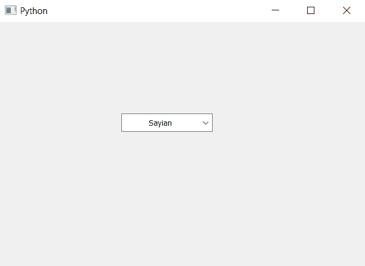

# PyQt5–如何使可编辑组合框的文本居中对齐

> 原文:[https://www . geesforgeks . org/pyqt 5-如何制作文本-居中对齐-可编辑-组合框/](https://www.geeksforgeeks.org/pyqt5-how-to-make-text-center-align-of-the-editable-combobox/)

在本文中，我们将看到如何居中对齐组合框的文本。默认情况下，组合框文本是左对齐的，组合框没有自己的对齐方式。

> **为了居中对齐文本，我们必须执行以下操作–**
> 
> 1.创建组合框
> 2。使组合框可编辑(可选)
> 3。从组合框
> 4 制作线条编辑对象。居中对齐线编辑

**语法:**用于创建线编辑并设置其对齐方式

```py
# getting the line edit of combo box
line_edit = self.combo_box.lineEdit()

# setting line edit alignment to the center
line_edit.setAlignment(Qt.AlignCenter)

```

以下是实施–

```py
# importing libraries
from PyQt5.QtWidgets import * 
from PyQt5 import QtCore, QtGui
from PyQt5.QtGui import * 
from PyQt5.QtCore import * 
import sys

class Window(QMainWindow):

    def __init__(self):
        super().__init__()

        # setting title
        self.setWindowTitle("Python ")

        # setting geometry
        self.setGeometry(100, 100, 600, 400)

        # calling method
        self.UiComponents()

        # showing all the widgets
        self.show()

    # method for widgets
    def UiComponents(self):

        # creating a combo box widget
        self.combo_box = QComboBox(self)

        # setting geometry of combo box
        self.combo_box.setGeometry(200, 150, 150, 30)

        # geek list
        geek_list = ["Sayian", "Super Saiyan", "Super Sayian 2", "Super Sayian B"]

        # making it editable
        self.combo_box.setEditable(True)

        # adding list of items to combo box
        self.combo_box.addItems(geek_list)

        # getting the line edit of combo box
        line_edit = self.combo_box.lineEdit()

        # setting line edit alignment to the center
        line_edit.setAlignment(Qt.AlignCenter)

# create pyqt5 app
App = QApplication(sys.argv)

# create the instance of our Window
window = Window()

# start the app
sys.exit(App.exec())
```

**输出:**
