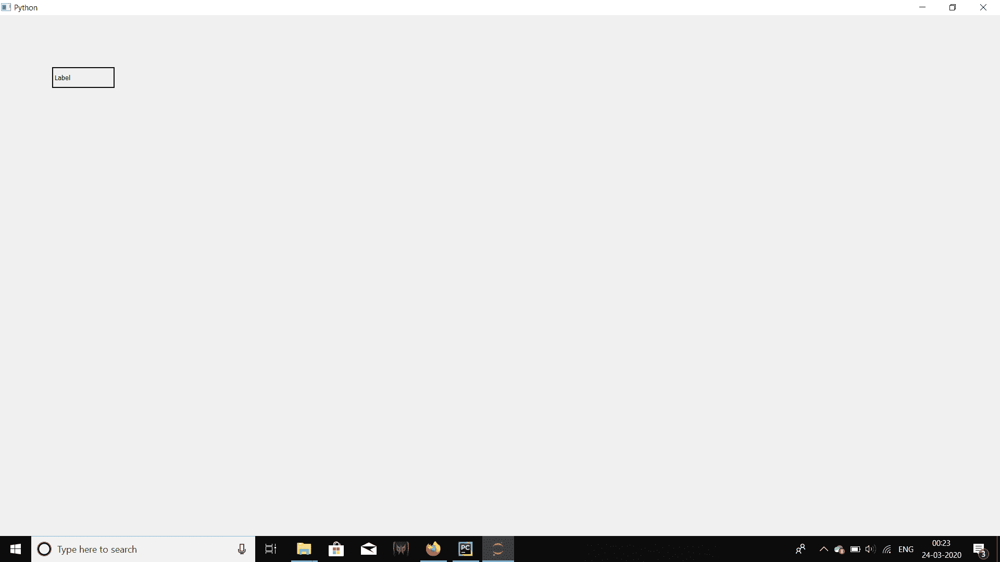

# pyqt 5–如何以最大化格式打开窗口？

> 原文:[https://www . geesforgeks . org/pyqt 5-如何以最大化格式打开窗口/](https://www.geeksforgeeks.org/pyqt5-how-to-open-window-in-maximized-format/)

在本文中，我们将看到如何使窗口以最大化格式打开，这指的是全屏显示窗口。我们可以用属于`QWidget class`的`showMaximized`方法来做到这一点。

> **语法:** self.showMaximized()
> 
> **论证:**不需要论证。
> 
> **执行的动作**将全屏打开窗口。

**代码:**

```py
# importing libraries
from PyQt5.QtWidgets import * 
from PyQt5.QtGui import * 
from PyQt5.QtCore import * 
import sys

class Window(QMainWindow):
    def __init__(self):
        super().__init__()

        # setting title
        self.setWindowTitle("Python ")

        # setting geometry
        self.setGeometry(100, 100, 600, 400)

        # calling method
        self.UiComponents()

        # showing all the widgets
        self.show()

    # method for widgets
    def UiComponents(self):

        # creating label
        label = QLabel("Label", self)

        # setting geometry to label
        label.setGeometry(100, 100, 120, 40)

        # adding border to label
        label.setStyleSheet("border : 2px solid black")

        # opening window in maximized size
        self.showMaximized()

# create pyqt5 app
App = QApplication(sys.argv)

# create the instance of our Window
window = Window()

# start the app
sys.exit(App.exec())
```

**输出:**
