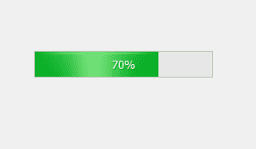
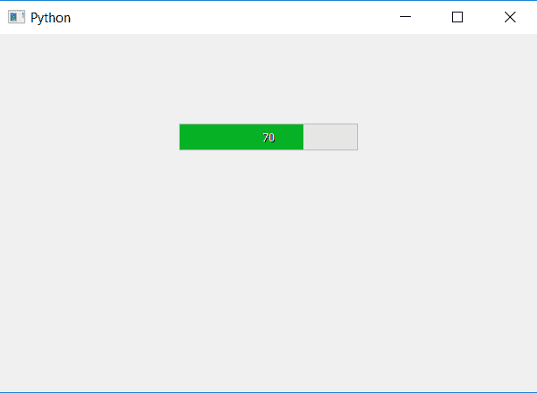

# PyQt5–如何从进度条中删除百分比符号？

> 原文:[https://www . geesforgeks . org/pyqt 5-如何从进度条中删除百分比符号/](https://www.geeksforgeeks.org/pyqt5-how-to-remove-the-percentage-symbol-from-the-progress-bar/)

在本文中，我们将看到如何删除进度条 I 中的百分比符号..e '% '，当我们创建进度条时默认会出现百分比和百分比符号。

为了只移除百分比符号，我们必须更改进度条的格式，下面是移除百分比符号后正常进度条的外观。
 

默认情况下，格式为“%p%”，这里 p 代表百分比，如果我们将其更改为“%p”，它将只显示数字，而不显示百分比符号。

下面是实现。

```
# importing libraries
from PyQt5.QtWidgets import * 
from PyQt5 import QtCore, QtGui
from PyQt5.QtGui import * 
from PyQt5.QtCore import * 
import sys

class Window(QMainWindow):

    def __init__(self):
        super().__init__()

        # setting title
        self.setWindowTitle("Python ")

        # setting geometry
        self.setGeometry(100, 100, 600, 400)

        # calling method
        self.UiComponents()

        # showing all the widgets
        self.show()

    # method for widgets
    def UiComponents(self):
        # creating progress bar
        bar = QProgressBar(self)

        # setting geometry to progress bar
        bar.setGeometry(200, 100, 200, 30)

        # setting the value
        bar.setValue(70)

        # setting alignment to center
        bar.setAlignment(Qt.AlignCenter)

        # removing percentage symbol
        bar.setFormat("% p")

App = QApplication(sys.argv)

# create the instance of our Window
window = Window()

# start the app
sys.exit(App.exec())
```

**输出:**
