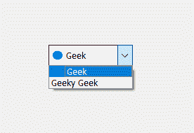
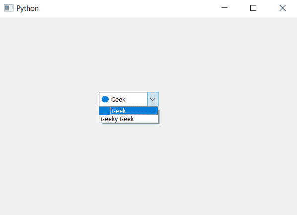

# PyQt5–如何在组合框

中设置每个项目的图标

> 原文:[https://www . geesforgeks . org/pyqt 5-如何将图标设置到组合框中的每个项目/](https://www.geeksforgeeks.org/pyqt5-how-to-set-icon-to-the-each-item-in-combobox/)

在这篇文章中，我们将看到如何添加图标到组合框的项目。默认情况下，组合框中的图标没有图标设置，虽然我们可以借助`setItemIcon`方法为每个项目设置图标，下面是组合框中项目图标的外观表示。



> **语法:** combobox.setItemIcon(索引，图标)
> 
> **参数:**需要两个参数，一个是整数，即项目的索引，另一个是 QIcon 对象
> 
> **动作**它将在给定的索引处为项目设置图标

以下是实施–

```py
# importing libraries
from PyQt5.QtWidgets import * 
from PyQt5 import QtCore, QtGui
from PyQt5.QtGui import * 
from PyQt5.QtCore import * 
import sys

class Window(QMainWindow):

    def __init__(self):
        super().__init__()

        # setting title
        self.setWindowTitle("Python ")

        # setting geometry
        self.setGeometry(100, 100, 600, 400)

        # calling method
        self.UiComponents()

        # showing all the widgets
        self.show()

    # method for widgets
    def UiComponents(self):

        # creating a combo box widget
        self.combo_box = QComboBox(self)

        # setting geometry of combo box
        self.combo_box.setGeometry(200, 150, 120, 30)

        # geek list
        geek_list = ["Geek", "Geeky Geek"]

        # adding list of items to combo box
        self.combo_box.addItems(geek_list)

        # creating editable combo box
        self.combo_box.setEditable(True)

        # index 
        index = 0

        # icon
        icon = QIcon('logo.png')

        # adding icon to the given index
        self.combo_box.setItemIcon(index, icon)

# create pyqt5 app
App = QApplication(sys.argv)

# create the instance of our Window
window = Window()

# start the app
sys.exit(App.exec())
```

**输出:**
