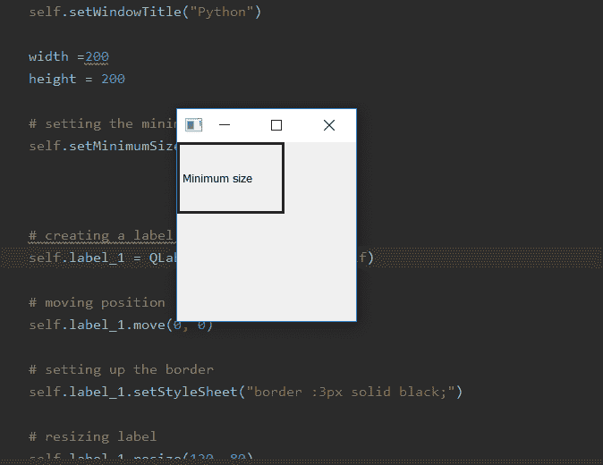

# PyQt5–如何设置窗口最小尺寸|设置最小尺寸方法

> 原文:[https://www . geesforgeks . org/pyqt 5-如何设置最小窗口大小-setminimumsize-method/](https://www.geeksforgeeks.org/pyqt5-how-to-set-minimum-size-of-window-setminimumsize-method/)

我们知道我们可以调整 PyQt5 应用程序的窗口大小，但是在缩小窗口大小的同时，我们可以设置最小大小，这样它就不能再缩小了。在本文中，我们将看到如何做到这一点。

为了做到这一点，我们将使用`setMinimumSize()`方法。

> **语法:** self.setMinimumSize(宽度、高度)
> 
> **自变量:**取两个整数作为自变量。
> 
> **执行的动作:**设置窗口的最小尺寸。

**代码:**

```py
# importing the required libraries

from PyQt5.QtCore import * 
from PyQt5.QtGui import * 
from PyQt5.QtWidgets import * 
import sys

class Window(QMainWindow):
    def __init__(self):
        super().__init__()

        # set the title
        self.setWindowTitle("Python")

        width = 200
        height = 200

        # setting the minimum size
        self.setMinimumSize(width, height)

        # creating a label widget
        self.label_1 = QLabel("Minimum size", self)

        # moving position
        self.label_1.move(0, 0)

        # setting up the border
        self.label_1.setStyleSheet("border :3px solid black;")

        # resizing label
        self.label_1.resize(120, 80)

        # show all the widgets
        self.show()

# create pyqt5 app
App = QApplication(sys.argv)

# create the instance of our Window
window = Window()

# start the app
sys.exit(App.exec())
```

**输出:**
